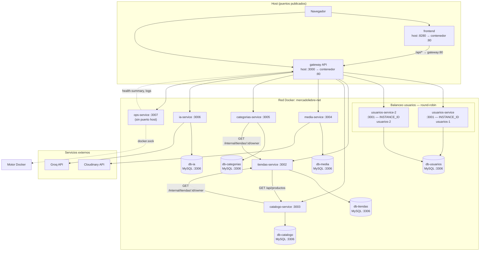

# Mercado Liebre — Sistema distribuido (entrega final)

Plataforma para que pequeños negocios publiquen y administren su catálogo digital: tiendas, productos, categorías, imágenes (Cloudinary), asistente IA (Groq) y personalización visual.

**Stack:** Docker Compose, API Gateway (Nginx), 6 microservicios de negocio (Node.js/Express), 6 bases MySQL (database-per-service), panel de operaciones, circuit breakers (Opossum) y balanceo de carga en el servicio de usuarios.

---

## 1. Descripción general del sistema

### Propósito

Centralizar la creación y administración de tiendas online para negocios pequeños, con una API distribuida, resiliente y escalable, accesible desde un frontend SPA y un único punto de entrada (gateway).

### Problemática que resuelve

Muchos negocios no tienen sitio propio, dependen de herramientas genéricas o redes sociales, y les cuesta mantener catálogo, precios e imágenes actualizados. Mercado Liebre unifica registro, tienda, productos, categorías, media e IA en un mismo ecosistema.

### Funcionalidades principales

| Área | Funcionalidad |
|------|----------------|
| Autenticación | Registro, login, JWT, perfil (`/api/auth/*`) |
| Tiendas | CRUD tiendas, temas visuales, vista pública compuesta |
| Catálogo | CRUD productos por tienda |
| Categorías | CRUD categorías por tienda |
| Media | Subida de imágenes a Cloudinary con auditoría en BD |
| IA | Generación de texto vía Groq con auditoría en BD |
| Operaciones | Panel de health, logs Docker, laboratorio de breakers, prueba de balanceo |

### Usuarios del sistema

| Rol | Descripción |
|-----|-------------|
| Dueño de negocio | Crea tienda, productos, categorías, sube media, usa IA |
| Cliente / visitante | Consulta catálogo público (`/api/tiendas/:id/vista-publica`) |
| Operador / equipo técnico | Panel ops: monitoreo, logs, escenarios de resiliencia |

### Alcance actual del proyecto

- Arquitectura de microservicios **funcional** en Docker (no simulada).
- Comunicación HTTP entre servicios (tiendas ↔ catálogo ↔ categorías).
- Persistencia con volúmenes Docker y una BD MySQL por dominio.
- Circuit breaker, health checks, logs estructurados y balanceo round-robin en usuarios (2 réplicas).
- Frontend React consumiendo API vía gateway.
- Fuera de alcance actual: réplicas de gateway, Kubernetes, colas de mensajes, CDN propio.

---

## 2. Arquitectura final del sistema

### Diagrama (puertos host e internos)

Leyenda: **host** = máquina donde corre Docker; **red interna** = `mercadoliebre-net` (DNS por nombre de servicio).



### Tabla de puertos y exposición

| Componente | Nombre Docker | Puerto interno | Puerto host (`.env`) | Expuesto al host |
|------------|---------------|----------------|----------------------|------------------|
| Frontend SPA | `frontend` | 80 | `8280` (`FRONTEND_HOST_PORT`) | Sí |
| API Gateway | `gateway` | 80 | `3000` (`GATEWAY_HOST_PORT`) | Sí |
| Usuarios réplica 1 | `usuarios-service` | 3001 | — | No (solo red interna) |
| Usuarios réplica 2 | `usuarios-service-2` | 3001 | — | No |
| Tiendas | `tiendas-service` | 3002 | — | No |
| Catálogo | `catalogo-service` | 3003 | — | No |
| Media | `media-service` | 3004 | — | No |
| Categorías | `categorias-service` | 3005 | — | No |
| IA | `ia-service` | 3006 | — | No |
| Ops | `ops-service` | 3007 | — | No (acceso vía gateway `/ops-panel/`) |
| MySQL × 6 | `db-usuarios` … `db-ia` | 3306 | — | No |

### Microservicios, gateway y bases de datos

| Servicio | Carpeta | Base de datos | Entidad principal |
|----------|---------|---------------|-------------------|
| **usuarios** | `microservices/servicio-usuarios/` | `db-usuarios` / `usuarios_db` | `usuarios` |
| **tiendas** | `microservices/servicio-tiendas/` | `db-tiendas` / `tiendas_db` | `tiendas`, `temas` |
| **catálogo** | `microservices/servicio-catalogo/` | `db-catalogo` / `catalogo_db` | `productos` |
| **categorías** | `microservices/servicio-categorias/` | `db-categorias` / `categorias_db` | `categorias` |
| **media** | `microservices/servicio-media/` | `db-media` / `media_db` | `media_assets` |
| **ia** | `microservices/servicio-ia/` | `db-ia` / `ia_db` | `ia_generaciones` |
| **ops** | `microservices/servicio-ops/` | — | Monitoreo y control operativo |
| **gateway** | `gateway/` | — | Enrutamiento y balanceo |
| **frontend** | raíz (`Dockerfile`, `paginas/`) | — | SPA React |

### Comunicación entre servicios (HTTP)

| Origen | Destino | Uso | Autenticación |
|--------|---------|-----|----------------|
| Catálogo | Tiendas | Validar que el usuario es dueño de la tienda | Header `X-Internal-Token` |
| Categorías | Tiendas | Igual que catálogo | `X-Internal-Token` |
| Tiendas | Catálogo | Listar productos en vista pública | Público (query `tienda_id`) |
| Todos los MS | Su MySQL | Persistencia del dominio | Credenciales en `.env` |
| Media | Cloudinary | Subida de imágenes | API keys en `.env` |
| IA | Groq | Generación de texto | `GROQ_API_KEY` en `.env` |
| Ops | Gateway | Agregar health de todos los servicios | Interno `gateway:80` |

### Flujo de una petición (ejemplo: login)

1. Cliente → `http://localhost:8280/api/login` (frontend Nginx).
2. Frontend proxy → `http://gateway:80/api/login` (red interna).
3. Gateway Nginx → `usuarios_upstream` (round-robin: `usuarios-service:3001` o `usuarios-service-2:3001`).
4. Microservicio usuarios → consulta `db-usuarios:3306` (protegida por circuit breaker `usuarios-mysql`).
5. Respuesta JSON con JWT al cliente.

### Dependencias (Docker Compose)

```
db-* (healthy) → microservicio de negocio → gateway → frontend
ops-service → gateway (monitoreo); ops monta docker.sock
```

Red única: `mercadoliebre-net` (driver `bridge`). Volúmenes: `usuarios_data`, `tiendas_data`, `catalogo_data`, `media_data`, `categorias_data`, `ia_data`.

---

## 3. Justificación de arquitectura

### Por qué microservicios

- **Dominios distintos** (auth, tiendas, catálogo, etc.) con ciclos de cambio independientes.
- **Aislamiento de fallos:** caída de IA o Cloudinary no tumba usuarios ni tiendas.
- **Escalabilidad selectiva:** hoy se replicó usuarios (mayor carga de login/registro).
- **Alineación con el curso:** gateway, HTTP entre servicios, BD por servicio, contenedores y resiliencia.

### Responsabilidades por servicio

Cada microservicio posee su código, Dockerfile, `init-db/init.sql` y puerto interno. Solo **ops** no tiene BD propia; orquesta observabilidad.

### Ventajas obtenidas

- Despliegue y prueba por dominio (`docker compose up catalogo-service db-catalogo`).
- Contrato de health unificado (`packages/resilience/health.js`).
- Entrada única al backend (gateway) simplifica el frontend y Postman.

### Dificultades encontradas

- **Consistencia entre dominios** sin transacciones distribuidas (referencias por `usuario_id` / `tienda_id`).
- **Orden de arranque** de MySQL (healthchecks + `depends_on: service_healthy`).
- **Depuración** de errores entre contenedores (logs Pino + panel ops + `requestId`).
- **Circuit breaker** requiere volumen de fallos antes de abrir (`volumeThreshold` en Opossum).

---

## 4. Tolerancia a fallos

### Manejo de errores

- Respuestas HTTP explícitas (400, 401, 403, 409, 502, 503).
- Clasificación de errores del breaker: `circuit_open`, `timeout`, `upstream_error` (`packages/resilience/circuit-breaker.js`).
- Integración servicio-a-servicio: fallo en validación de dueño → 403 sin propagar excepción cruda.

### Circuit breaker (Opossum)

Paquete compartido: `packages/resilience/`. Cada servicio define breakers en `src/breakers.js`.

| Servicio | Breaker | Dependencia protegida |
|----------|---------|------------------------|
| usuarios | `usuarios-mysql` | MySQL |
| tiendas | `tiendas-catalogo-productos` | HTTP → catálogo |
| catálogo | `catalogo-tiendas-owner` | HTTP → tiendas |
| categorías | `categorias-tiendas-owner` | HTTP → tiendas |
| media | `media-cloudinary-upload` | Cloudinary |
| ia | `ia-groq` | API Groq |

Estados: `closed` → `open` → `half_open` → `closed`. Logs en cada transición (`attachBreakerLogs`).

### Recuperación (half-open)

Opossum permite una petición de prueba en `half_open`; si tiene éxito, vuelve a `closed`. Control manual para pruebas: `POST /api/health/breakers/control/{servicio}` con header `X-Ops-Lab-Token` (mismo valor que `OPS_PANEL_TOKEN` / `OPS_LAB_TOKEN`).

### Validación de disponibilidad

- **Por servicio:** `GET /api/health/{servicio}` → `status`: `ok` | `degraded` | `down`, `db.latency_ms`, `breakers[]`.
- **Gateway:** `GET /api/health` → JSON con estrategia de balanceo.
- **Readiness:** `GET /api/health/ready` en cada microservicio.
- **Agregado:** `GET /api/ops/health-summary` (requiere token ops).

### Logs

Logger **Pino** por servicio (`src/logger.js`). Eventos de breaker con `event: 'circuit_breaker'`. Consulta: `docker compose logs usuarios-service` o panel ops → logs reales vía `docker.sock`.

### Ejemplos reales en el sistema

**Health con latencia y breakers:**

```http
GET http://localhost:3000/api/health/usuarios
```

Respuesta incluye: `instance_id`, `db.ok`, `db.latency_ms`, `breakers[].state`, `breakers[].stats` (successes, failures, rejects, timeouts).

**Login con breaker abierto (MySQL caído):**

```json
{
  "error": "Servicio temporalmente protegido (circuit breaker sobre base de datos)",
  "reason": "circuit_open"
}
```

**Catálogo sin poder validar dueño en tiendas:**

El cliente HTTP devuelve `false` y la ruta responde 403; en logs: `reason: circuit_open` o `upstream_error`.

---

## 5. Escalabilidad y administración

### Balanceo de carga implementado

Se cubren **replicación**, **distribución de peticiones**, **balanceo Nginx** y **prueba de carga**:

| Mecanismo | Implementación |
|-----------|----------------|
| Réplicas | `usuarios-service` + `usuarios-service-2` en `docker-compose.yml` |
| Distribución | `upstream usuarios_upstream` en `gateway/nginx.conf` (round-robin) |
| Identificación | `INSTANCE_ID` en `config.js`; respuesta en `/api/health` |
| Prueba | Panel ops o `GET /api/ops/load-balance/test?requests=40` |

```nginx
# gateway/nginx.conf
upstream usuarios_upstream {
    server usuarios-service:3001 max_fails=3 fail_timeout=10s;
    server usuarios-service-2:3001 max_fails=3 fail_timeout=10s;
}
```

Rutas balanceadas: `/api/login`, `/api/registro`, `/api/auth/*`, `/api/health/usuarios`, control de breakers de usuarios.

**Verificación en consola:**

```powershell
1..40 | ForEach-Object {
  (Invoke-RestMethod "http://localhost:3000/api/health/usuarios").instance_id
} | Group-Object | Select-Object Name, Count
```

Resultado esperado: reparto entre `usuarios-1` y `usuarios-2`.

### Cómo podría escalar el sistema

- Más réplicas de usuarios (añadir `server` al upstream y contenedor en Compose).
- Réplicas de gateway detrás de un load balancer externo.
- Escalar horizontalmente servicios stateless; BD por dominio con réplicas de lectura o sharding futuro.

### Limitaciones actuales

- Una sola réplica por servicio (excepto usuarios).
- Gateway y ops son punto único.
- Sin service mesh ni colas para desacoplar aún más.
- Media e IA dependen de APIs externas (Cloudinary, Groq).

### Mejoras futuras

- Kubernetes / Docker Swarm para orquestación.
- Caché (Redis) en lecturas de catálogo.
- Tracing distribuido (OpenTelemetry).
- Secret manager en lugar de `.env` en disco.

---

## 6. Seguridad básica

### Variables de entorno

| Variable | Uso |
|----------|-----|
| `JWT_SECRET` | Firma y validación de tokens entre servicios |
| `INTERNAL_SERVICE_TOKEN` | Rutas `/internal/*` (solo servidor a servidor) |
| `OPS_PANEL_TOKEN` | API del panel ops (`Authorization: Bearer`) |
| `MYSQL_*` | Credenciales de bases de datos |
| `CLOUDINARY_*` | Solo servicio media |
| `GROQ_API_KEY` | Solo servicio ia |

- Plantilla: **`.env.example`** (sin secretos reales).
- **`.env`** está en `.gitignore`; no debe subirse a Git.
- En producción: rotar tokens, no exponer `docker.sock` sin control, usar HTTPS delante del gateway.

---

## 7. Implementación técnica (requisitos del curso)

| Requisito | Cumplimiento |
|-----------|--------------|
| ≥ 4 microservicios | 6 de negocio + ops |
| API Gateway | Nginx `gateway/` |
| BD desacoplada | 6 MySQL, database-per-service |
| HTTP entre servicios | tiendas ↔ catálogo ↔ categorías |
| `docker-compose.yml` + Dockerfile por servicio | Sí |
| Red Docker | `mercadoliebre-net` |
| Volúmenes persistentes | 6 volúmenes nombrados |
| ≥ 2 endpoints por MS (GET + POST) | Ver tabla siguiente |
| Circuit breaker + logs + half-open | Opossum + Pino |
| Health + latencia + contadores | `/api/health`, `stats` en breakers |
| Balanceo / escalabilidad | Réplicas usuarios + Nginx + prueba ops |

### Endpoints por microservicio

| Servicio | GET | POST |
|----------|-----|------|
| **usuarios** | `/api/auth/me`, `/api/health` | `/api/registro`, `/api/login` |
| **tiendas** | `/api/tiendas`, `/api/tiendas/:id/vista-publica` | `/api/tiendas` |
| **catálogo** | `/api/productos` | `/api/productos` |
| **categorías** | `/api/categorias` | `/api/categorias` |
| **media** | `/api/health` | `/api/media/upload` |
| **ia** | `/api/health` | `/api/ia/generar` |
| **ops** | `/api/ops/health-summary`, `/api/ops/load-balance/test` | `/api/ops/action` |

Rutas de diagnóstico adicionales: `/api/health/breakers/{servicio}`, `/api/health/ready`.

Colección Postman: `postman/Mercado_Liebre_API.postman_collection.json`.

### Integración entre servicios (ejemplo)

**Vista pública de tienda** (`tiendas-service`):

1. Lee tienda y tema en `db-tiendas`.
2. Llama a `catalogo-service` → `GET /api/productos?tienda_id=...` (circuit breaker `tiendas-catalogo-productos`).
3. Devuelve JSON unificado al cliente.

**Crear producto** (`catalogo-service`):

1. Valida JWT.
2. Llama a `tiendas-service` → `GET /internal/tiendas/:id/owner` con `X-Internal-Token`.
3. Si es dueño, inserta en `db-catalogo`.

---

## 8. Repositorio y documentación

### Estructura

```
Mercado_Liebre/
├── docker-compose.yml
├── .env.example
├── Dockerfile                 # Frontend
├── nginx.conf                 # Proxy SPA → gateway
├── gateway/
│   ├── Dockerfile
│   └── nginx.conf             # API Gateway + balanceo
├── packages/resilience/       # Circuit breaker + health compartido
├── microservices/
│   ├── servicio-usuarios/
│   ├── servicio-tiendas/
│   ├── servicio-catalogo/
│   ├── servicio-categorias/
│   ├── servicio-media/
│   ├── servicio-ia/
│   └── servicio-ops/
├── paginas/  componentes/  lib/
├── postman/
├── docs/                      # Documento técnico PDF (entrega)
├── evidencias/                # Capturas del sistema en ejecución
└── README.md
```

Cada microservicio:

```
servicio-*/
├── Dockerfile
├── init-db/init.sql
└── src/
    ├── index.js, app.js, config.js, breakers.js
    ├── routes/
    └── middleware/
```

### Evidencias mínimas (carpeta `evidencias/`)

| Tema | Qué capturar |
|------|----------------|
| Docker | `docker ps` con contenedores Up |
| Comunicación | Postman o navegador: vista pública / productos |
| Base de datos | Registro en `usuarios` o filas en MySQL |
| Circuit breaker | Health OK → fallo → `open` → recuperación |
| Monitoreo | Panel ops, JSON de `/api/health`, logs |
| Balanceo | Resultado 40 peticiones `usuarios-1` / `usuarios-2` |

---

## 9. Ejecución

### Requisitos

- Docker Desktop o Docker Engine + Compose v2
- Copiar `.env.example` → `.env` y completar valores

### Levantar el stack completo

```bash
cd Mercado_Liebre
docker compose up --build
```

### URLs por defecto

| Recurso | URL |
|---------|-----|
| Frontend | http://localhost:8280 |
| API Gateway | http://localhost:3000 |
| Panel operaciones | http://localhost:8280/ops-panel/ |
| Health gateway | http://localhost:3000/api/health |

### Desarrollo frontend sin Docker

```bash
npm install
npm run dev
```

Proxy Vite (`vite.config.ts`) → `http://127.0.0.1:3000`.

---

## 10. Tecnologías utilizadas

| Capa | Tecnología |
|------|------------|
| Frontend | React, TypeScript, Vite |
| API Gateway | Nginx |
| Microservicios | Node.js 20, Express |
| Base de datos | MySQL 8 |
| Resiliencia | Opossum (circuit breaker), Pino (logs) |
| Contenedores | Docker, Docker Compose |
| Auth | JWT (jsonwebtoken), bcrypt |
| Media | Cloudinary |
| IA | Groq API |

---

## 11. Panel de operaciones

| URL | Descripción |
|-----|-------------|
| http://localhost:8280/ops-panel/ | UI vía frontend |
| http://localhost:3000/ops-panel/ | UI vía gateway |

Funciones: health agregado, estado de breakers, logs Docker (`docker logs`), start/stop de contenedores en whitelist, laboratorio de circuit breaker, prueba de balanceo de carga.

Autenticación API ops: header `Authorization: Bearer <OPS_PANEL_TOKEN>`.

Documentación ampliada de resiliencia: `microservices/servicio-ops/GUIA_RESILIENCIA_MICROSERVICIOS.md`.

---

## 12. Archivos Docker

| Archivo | Rol |
|---------|-----|
| `docker-compose.yml` | Servicios, réplicas, redes, volúmenes, healthchecks |
| `gateway/Dockerfile` + `gateway/nginx.conf` | API Gateway y balanceo |
| `Dockerfile` + `nginx.conf` (raíz) | Build y proxy del frontend |
| `microservices/servicio-*/Dockerfile` | Cada microservicio |
| `.dockerignore` | Exclusiones de build |
| `.env.example` | Plantilla de variables |

---

## Referencias

- Guía de resiliencia por servicio: `microservices/servicio-ops/GUIA_RESILIENCIA_MICROSERVICIOS.md`
- Documento técnico formal (PDF): `docs/` (entrega académica)
- Evidencias: `evidencias/`
