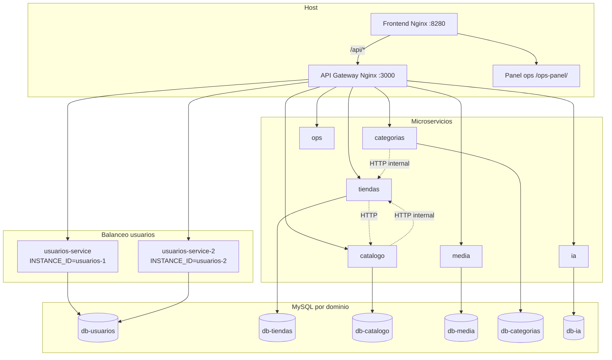

# Mercado Liebre

Mercado Liebre es una plataforma para que pequeños negocios publiquen y administren su catálogo digital: tiendas, productos, categorías, media (Cloudinary), asistente IA (Groq) y personalización visual.

El proyecto implementa **microservicios** con Docker Compose: **API Gateway (Nginx)**, **6 microservicios de negocio** (Node.js/Express), **6 bases MySQL** (database-per-service), **panel de operaciones** (`servicio-ops`), **circuit breakers** compartidos y **balanceo de carga** en el servicio de usuarios.

---

## Problema que resuelve

Muchos negocios pequeños no tienen sitio propio, dependen de herramientas genéricas y les cuesta mantener el catálogo actualizado. Mercado Liebre centraliza la administración y expone una vista pública para clientes.

## Usuarios del sistema

| Rol | Descripción |
|-----|-------------|
| Administrador de plataforma | Operación global, panel ops |
| Dueño de negocio | Tienda, productos, temas, media, IA |
| Cliente / visitante | Catálogo público |

---

## Arquitectura actual



### Componentes (Docker Compose)

| Componente | Carpeta / imagen | Puerto host (`.env`) | Función |
|--------------|------------------|----------------------|---------|
| **frontend** | `Dockerfile` + `nginx.conf` | `8280` | SPA React/Vite |
| **gateway** | `gateway/` | `3000` | Enrutamiento, balanceo usuarios, health proxy |
| **usuarios-service** | `microservices/servicio-usuarios/` | interno `3001` | Auth, JWT — **réplica 1** |
| **usuarios-service-2** | mismo Dockerfile | interno `3001` | Auth — **réplica 2** |
| **tiendas-service** | `microservices/servicio-tiendas/` | `3002` | Tiendas, temas, `/internal` |
| **catalogo-service** | `microservices/servicio-catalogo/` | `3003` | Productos |
| **media-service** | `microservices/servicio-media/` | `3004` | Upload Cloudinary |
| **categorias-service** | `microservices/servicio-categorias/` | `3005` | Categorías |
| **ia-service** | `microservices/servicio-ia/` | `3006` | Groq |
| **ops-service** | `microservices/servicio-ops/` | vía gateway | Panel, logs Docker, laboratorio |
| **db-*** | MySQL 8 × 6 | — | Una BD por microservicio |

### Paquete compartido de resiliencia

`packages/resilience/` — usado por los 6 microservicios de negocio:

- `circuit-breaker.js` — Opossum
- `health.js` — `/api/health`, breakers, payload unificado
- `breaker-control.js` — control real del breaker (laboratorio)

### Flujo de una petición

1. El navegador entra en `http://localhost:8280`.
2. El Nginx del **frontend** reenvía `/api/*` al **gateway** (`gateway:80`).
3. El gateway elige el microservicio por prefijo (`/api/login` → usuarios con **balanceo**).
4. Cada servicio usa solo su MySQL; referencias cruzadas son lógicas (`usuario_id`, `tienda_id`).
5. **Tiendas ↔ Catálogo / Categorías**: HTTP interno con `INTERNAL_SERVICE_TOKEN`.

---

## Balanceo de carga / Escalabilidad

**Implementación elegida:** la más simple y funcional para este stack — **réplicas de `usuarios` + balanceo Nginx + prueba automática**. Con una sola entrega cubrís **las cuatro opciones** del enunciado.

### Qué decirle a la profesora (resumen oral)

> «Implementamos **replicación** del microservicio de usuarios (dos contenedores), **distribución de peticiones** con **balanceo round-robin en Nginx** en el API Gateway, y una **prueba de escalabilidad** en el panel ops que dispara N requests y muestra qué réplica atendió cada una (`instance_id`).»

### Mapa opción del enunciado → código en el repo

| Opción del enunciado | Qué hicimos | Archivo(s) principal(es) |
|----------------------|-------------|---------------------------|
| **1 — Replicación de servicios** | Dos contenedores del mismo servicio usuarios | `docker-compose.yml` → `usuarios-service` y `usuarios-service-2` (líneas ~172–220) |
| **2 — Distribución de peticiones** | Nginx reparte login, registro, auth y health entre réplicas | `gateway/nginx.conf` → `upstream usuarios_upstream` (2 `server`) |
| **3 — Prueba simple de escalabilidad** | API + UI que lanzan N peticiones y cuentan por `instance_id` | `microservices/servicio-ops/src/loadBalanceTest.js`, `public/panel-loadbalance.js`, `GET /api/ops/load-balance/test` |
| **4 — Balanceo de carga básico** | Upstream Nginx con round-robin y `max_fails` | `gateway/nginx.conf` (mismo bloque `usuarios_upstream`) |

### Detalle por capa

**Réplica 1 y 2 (Compose)**

```yaml
# docker-compose.yml
usuarios-service:     INSTANCE_ID: usuarios-1
usuarios-service-2:   INSTANCE_ID: usuarios-2   # misma imagen, misma db-usuarios
```

**Balanceo (Gateway)**

```nginx
# gateway/nginx.conf
upstream usuarios_upstream {
    server usuarios-service:3001 max_fails=3 fail_timeout=10s;
    server usuarios-service-2:3001 max_fails=3 fail_timeout=10s;
}
```

Rutas que pasan por ese upstream: `/api/auth/*`, `/api/login`, `/api/registro`, `/api/health/usuarios`, control de breakers de usuarios.

**Identificar qué réplica respondió**

- `microservices/servicio-usuarios/src/config.js` → `INSTANCE_ID`
- `microservices/servicio-usuarios/src/routes/health.routes.js` → incluye `instance_id` en `/api/health`

**Prueba desde panel ops**

- UI: `http://localhost:8280/ops-panel/` → sección **«Balanceo de carga — usuarios (2 réplicas)»**
- API: `GET /api/ops/load-balance/test?requests=40` (header `Authorization: Bearer <OPS_PANEL_TOKEN>`)

**Prueba desde consola (PowerShell)**

```powershell
1..40 | ForEach-Object {
  (Invoke-RestMethod "http://localhost:3000/api/health/usuarios").instance_id
} | Group-Object | Select-Object Name, Count
```

Resultado esperado: reparto entre `usuarios-1` y `usuarios-2` (aprox. 50 % / 50 %).

---

## Resiliencia (circuit breaker)

Patrón **Circuit Breaker** (librería **Opossum**) en los 6 microservicios de negocio.

| Servicio | Breaker principal | Dependencia protegida |
|----------|-------------------|------------------------|
| usuarios | `usuarios-mysql` | MySQL |
| tiendas | `tiendas-catalogo-productos` | HTTP → catálogo |
| catálogo | `catalogo-tiendas-owner` | HTTP → tiendas |
| categorías | `categorias-tiendas-owner` | HTTP → tiendas |
| media | `media-cloudinary-upload` | Cloudinary |
| ia | `ia-groq` | API Groq |

- Health: `GET /api/health/<servicio>` y `GET /api/health/breakers/<servicio>` (vía gateway).
- Laboratorio: panel ops puede **abrir / cerrar / semiabrir** breakers reales (`POST /api/health/breakers/control/<servicio>`).
- Guía del equipo: `microservices/servicio-ops/GUIA_RESILIENCIA_MICROSERVICIOS.md`

---

## Panel de operaciones (`servicio-ops`)

| URL | Descripción |
|-----|-------------|
| `http://localhost:8280/ops-panel/` | UI (vía frontend) |
| `http://localhost:3000/ops-panel/` | UI (gateway directo) |

Funciones:

- Monitoreo health + circuit breakers (auto-refresh)
- Logs reales (`docker logs` vía socket)
- Start/Stop de contenedores en whitelist
- **Laboratorio circuit breaker** (escenarios Docker + HTTP)
- **Prueba de balanceo de carga**

Token: variable `OPS_PANEL_TOKEN` en `.env` (header `Authorization: Bearer ...`).

---

## Estructura del repositorio

```
Mercado_Liebre/
├── docker-compose.yml          # Stack completo
├── .env / .env.example
├── Dockerfile                  # Build frontend
├── nginx.conf                  # Proxy SPA → gateway
├── gateway/
│   ├── Dockerfile
│   └── nginx.conf              # API Gateway + balanceo usuarios
├── packages/resilience/        # Circuit breaker + health compartido
├── microservices/
│   ├── servicio-usuarios/
│   ├── servicio-tiendas/
│   ├── servicio-catalogo/
│   ├── servicio-categorias/
│   ├── servicio-media/
│   ├── servicio-ia/
│   └── servicio-ops/           # Panel + laboratorio + load-balance test
├── paginas/ componentes/ lib/  # Frontend React
├── postman/                    # Colección API
└── README.md
```

Cada microservicio sigue la misma estructura interna:

```
servicio-*/
├── Dockerfile
├── init-db/init.sql
└── src/
    ├── index.js
    ├── app.js
    ├── config.js
    ├── breakers.js
    ├── routes/
    └── middleware/
```

---

## Endpoints principales

### Diagnóstico y gateway

| Método | Ruta | Notas |
|--------|------|--------|
| GET | `/api/health` | Estado del gateway (incluye `load_balancing` en JSON) |
| GET | `/api/health/usuarios` | Health usuarios; respuesta incluye `instance_id` |
| GET | `/api/health/{tiendas\|catalogo\|media\|categorias\|ia}` | Por servicio |
| GET | `/api/health/breakers/{servicio}` | Estado Opossum |
| POST | `/api/health/breakers/control/{servicio}` | Laboratorio (token `X-Ops-Lab-Token`) |

### Ops (requieren `OPS_PANEL_TOKEN`)

| Método | Ruta |
|--------|------|
| GET | `/api/ops/health-summary` |
| GET | `/api/ops/containers` |
| GET | `/api/ops/logs?target=...` |
| POST | `/api/ops/action` | start/stop contenedor |
| GET | `/api/ops/load-balance/test?requests=40` | Prueba de balanceo |
| GET | `/api/ops/lab/scenarios` | Escenarios laboratorio |

### Negocio (resumen)

- **Auth:** `POST /api/registro`, `POST /api/login`, `GET /api/auth/me`
- **Tiendas / temas:** `/api/tiendas`, `/api/temas`
- **Productos:** `/api/productos`
- **Categorías:** `/api/categorias`
- **Media:** `POST /api/media/upload`
- **IA:** `/api/ia/*`

Colección Postman: `postman/Mercado_Liebre_API.postman_collection.json`

---

## Ejecución local con Docker

### Requisitos

- Docker Desktop (o Docker + Compose v2)
- Archivo `.env` (copiar desde `.env.example`)

### Levantar todo el stack

```bash
cd Mercado_Liebre
docker compose up --build
```

### URLs (valores por defecto en `.env.example`)

| Recurso | URL |
|---------|-----|
| Frontend | http://localhost:8280 |
| API Gateway | http://localhost:3000 |
| Panel ops | http://localhost:8280/ops-panel/ |
| Health gateway | http://localhost:3000/api/health |

### Levantar solo balanceo + gateway (si ya tenés el resto)

```bash
docker compose up -d --build gateway usuarios-service usuarios-service-2 ops-service
```

### Desarrollo frontend sin Docker

```bash
npm install
npm run dev
```

El proxy de Vite (`vite.config.ts`) apunta al gateway en `http://127.0.0.1:3000`.

---

## Archivos Docker relevantes

| Archivo | Rol |
|---------|-----|
| `docker-compose.yml` | Servicios, réplicas, redes, volúmenes, healthchecks |
| `gateway/Dockerfile` + `gateway/nginx.conf` | API Gateway y balanceo |
| `Dockerfile` + `nginx.conf` (raíz) | Frontend SPA |
| `microservices/servicio-*/Dockerfile` | Cada microservicio |
| `.dockerignore` | Exclusiones de build |
| `.env.example` | Plantilla de variables (no commitear `.env` real) |

---

## Riesgos y mitigación

| Riesgo | Impacto | Mitigación en el proyecto |
|--------|---------|---------------------------|
| Caída de una BD MySQL | Dominio afectado down/degraded | Healthchecks, circuit breaker MySQL, volúmenes, panel ops |
| Caída de Cloudinary / Groq | Media o IA degradados | Breakers dedicados, respuestas controladas |
| Caída de un microservicio | Rutas de ese dominio fallan | `restart: always`, health vía gateway |
| Caída de una réplica de usuarios | Menor capacidad; la otra sigue | Balanceo Nginx + 2 réplicas |
| Caída del gateway | Sin entrada unificada a la API | Contenedor con restart; en producción, réplicas del gateway |

---

## Demo sugerida (entrega / defensa)

1. `GET http://localhost:3000/api/health` — mostrar JSON con `load_balancing`.
2. Panel ops → **Balanceo de carga** → ejecutar prueba 40 peticiones → captura con `usuarios-1` y `usuarios-2`.
3. Panel ops → **Monitoreo** → circuit breakers en verde.
4. (Opcional) Laboratorio → stop `db-usuarios` → ver breaker abierto → start → recuperación.

---

## Referencias internas

- Resiliencia y asignación por integrante: `microservices/servicio-ops/GUIA_RESILIENCIA_MICROSERVICIOS.md`
- Monolito histórico (solo referencia): `servicio-api/DEPRECATED.md` si existe en el repo padre
