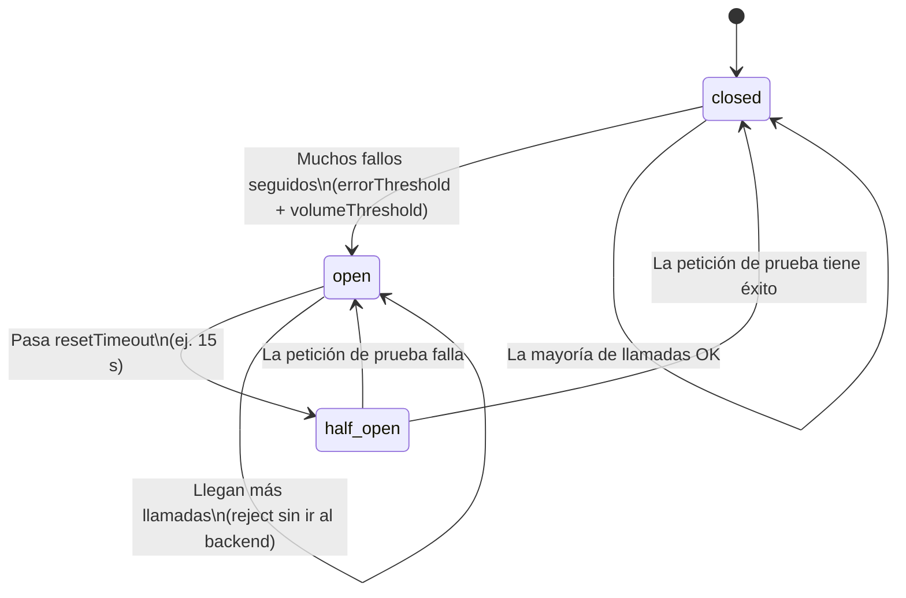
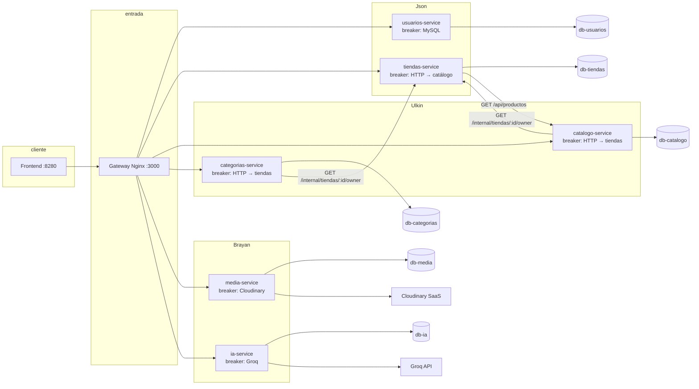

# Guía de resiliencia — 6 microservicios (para la defensa oral)

Documento de estudio para el equipo. La profesora pregunta en **Usuarios, Tiendas, Catálogo, Categorías, Media e IA**.  
Esta guía explica dónde está cada pieza en código real y cómo comprobar que funciona (gateway, `docker compose`, curl/Postman).

---

## Reparto del equipo

| Compañero | Microservicios | Puerto (interno Docker) |
|-----------|----------------|-------------------------|
| **Json** | Usuarios, Tiendas | 3001, 3002 |
| **Ulkin** | Catálogo, Categorías | 3003, 3005 |
| **Brayan** | Media, IA | 3004, 3006 |

Todos comparten el mismo **paquete** y la misma **forma** de health/logs; lo que cambia es **qué dependencia protege** cada breaker.

---

## 1. Respuestas rápidas (lo que suele preguntar la profesora)

### ¿Dónde está el circuit breaker?

| Servicio | Archivo principal | Nombre del breaker | Protege |
|----------|-------------------|--------------------|---------|
| Usuarios | `servicio-usuarios/src/breakers.js` | `usuarios-mysql` | Consultas MySQL (login, registro, perfil) |
| Tiendas | `servicio-tiendas/src/breakers.js` | `tiendas-catalogo-productos` | HTTP a Catálogo (vista pública) |
| Catálogo | `servicio-catalogo/src/breakers.js` | `catalogo-tiendas-owner` | HTTP a Tiendas (`/internal/.../owner`) |
| Categorías | `servicio-categorias/src/breakers.js` | `categorias-tiendas-owner` | HTTP a Tiendas (mismo endpoint interno) |
| Media | `servicio-media/src/breakers.js` | `media-cloudinary-upload` | Subida a Cloudinary |
| IA | `servicio-ia/src/breakers.js` | `ia-groq` | Llamadas a la API de Groq |

La librería que implementa el patrón es **[Opossum](https://github.com/nodeshift/opossum)** (`npm install opossum`).  
El código común (logs de transición, health, clasificar errores) está en:

```
Mercado_Liebre/packages/resilience/
├── index.js              → exporta todo el paquete @mercadoliebre/resilience
├── circuit-breaker.js    → attachBreakerLogs, classifyBreakerError
└── health.js             → pingDb, getBreakerState, buildHealthPayload
```

Cada Dockerfile de microservicio hace `COPY packages/resilience` y en `package.json` figura:

```json
"@mercadoliebre/resilience": "file:./packages/resilience"
```

### ¿Dónde están los logs?

| Tipo | Archivo | Qué registra |
|------|---------|--------------|
| Logger del servicio | `src/logger.js` (en cada microservicio) | Pino + `pino-http`: cada request HTTP con `requestId`, status, tiempo |
| Logs del circuit breaker | `packages/resilience/circuit-breaker.js` → `attachBreakerLogs()` | Eventos con `event: 'circuit_breaker'`, `state: open \| half_open \| closed` |
| Logs de negocio / errores | Rutas (`src/routes/*.js`) y clientes (`src/clients/*.js`) | Mensajes como `[usuarios] Login exitoso`, fallos de ownership, etc. |

Ver logs en ejecución:

```bash
docker compose logs -f usuarios-service
docker compose logs -f catalogo-service
# Filtrar solo circuit breaker (JSON de Pino):
docker compose logs usuarios-service 2>&1 | findstr circuit_breaker
```

### ¿Dónde está el health check?

Mismo contrato en los 6 servicios, archivo:

```
src/routes/health.routes.js
```

| Endpoint (dentro del microservicio) | Expuesto por gateway como | Propósito |
|-------------------------------------|---------------------------|-----------|
| `GET /api/health` | `GET /api/health/<servicio>` | Ping a MySQL + estado de breakers + `status`: `ok` / `degraded` / `down` |
| `GET /api/health/ready` | (directo al puerto del servicio o vía proxy si lo agregan) | ¿Listo para tráfico? (`ready` según BD) |
| `GET /api/health/breakers` | `GET /api/health/breakers/<servicio>` | Solo lista de breakers con `state` y contadores |

Rutas en gateway: `Mercado_Liebre/gateway/nginx.conf` (locations `/api/health/...` y `/api/health/breakers/...`).

### ¿Qué es closed, open y half_open?

Lo gestiona **Opossum en memoria** dentro de cada proceso (cada contenedor tiene su propio estado; no es un breaker global compartido).



| Estado | En español | Qué hace | Efecto para el usuario |
|--------|------------|----------|------------------------|
| **closed** | Cerrado (normal) | Las llamadas pasan al backend (MySQL, HTTP, Cloudinary, Groq) | Todo funciona si el backend está bien |
| **open** | Abierto | El breaker **rechaza** nuevas llamadas sin tocar el backend | Suele verse **503** con mensaje de circuit breaker |
| **half_open** | Semiabierto | **Una** llamada de prueba para ver si el backend volvió | Si funciona → vuelve a closed; si no → open otra vez |

Parámetros típicos (en `src/config.js` de cada servicio, variables `CB_*` en `.env`):

- `timeout` — si la operación tarda más, cuenta como fallo.
- `errorThresholdPercentage` — % de fallos para abrir (ej. 50).
- `volumeThreshold` — mínimo de intentos antes de poder abrir (ej. 5).
- `resetTimeout` — milisegundos en open antes de pasar a half_open (ej. 15000).

Los logs de transición los escribe `attachBreakerLogs` en `packages/resilience/circuit-breaker.js` (buscar `[resilience] Circuito ABIERTO`, `HALF-OPEN`, `CERRADO`).

---

## 2. Cómo se conectan entre sí (comunicación real)



**Token interno:** Catálogo y Categorías llaman a Tiendas con header `X-Internal-Token` (= `INTERNAL_SERVICE_TOKEN` en `.env`).  
Endpoint en Tiendas: `servicio-tiendas/src/routes/internal.routes.js` → `GET /internal/tiendas/:id/owner` (protegido por `internalAuth.js`).

**Flujo de archivos (ejemplo vista pública de tienda):**

1. Cliente → `GET /api/tiendas/:id/vista-publica` → gateway → **tiendas.routes.js**
2. Tiendas lee MySQL directo (`pool.query`) para tienda y tema.
3. Tiendas llama **`fetchProductosDeTienda`** → `clients/catalogo.client.js` → **`catalogoProductosBreaker.fire(...)`**
4. Si catálogo falla mucho → breaker **open** → respuesta **503** controlada en tiendas (no cuelga el servidor).

**Flujo de archivos (ejemplo crear producto en catálogo):**

1. `productos.routes.js` → **`isOwnerOfTienda`** → `clients/tiendas.client.js` → **`tiendasOwnerBreaker.fire(...)`**
2. Tiendas responde `{ usuario_id }` desde MySQL en `internal.routes.js`.

---

## 3. Piezas comunes en TODOS los microservicios (misma carpeta, mismo rol)

Cada servicio sigue esta estructura:

```
servicio-XXX/
├── src/
│   ├── index.js           → arranque: pool BD, listen, logs de inicio
│   ├── app.js             → Express: cors, json, requestId, httpLogger, rutas
│   ├── config.js          → PORT, DB, CIRCUIT_BREAKER, URLs de otros servicios
│   ├── db.js              → pool MySQL (donde hay BD)
│   ├── logger.js          → Pino + pino-http
│   ├── breakers.js        → instancias Opossum + attachBreakerLogs
│   ├── middleware/
│   │   ├── requestId.js   → X-Request-Id para correlacionar logs
│   │   └── auth.js        → JWT (donde aplica)
│   ├── routes/
│   │   ├── health.routes.js   → /api/health, /ready, /breakers
│   │   └── *.routes.js        → negocio; aquí se usa .fire() o queryWithBreaker
│   └── clients/           → (si hay HTTP externo) wrapper + breaker.fire()
└── package.json           → opossum, pino, @mercadoliebre/resilience
```

**Cadena típica cuando llega un request:**

```
index.js → createApp() → middleware requestId → httpLogger (log de request)
  → ruta de negocio → client o queryWithBreaker → breaker.fire()
       → éxito: respuesta JSON
       → fallo: classifyBreakerError → log + HTTP 502/503
```

---

# BLOQUE A — Json (Usuarios + Tiendas)

## A.1 Usuarios (`servicio-usuarios`)

### Propósito del servicio

Autenticación y datos de usuario (registro, login, perfil). Es la **única fuente de verdad** de credenciales.

### Circuit breaker

| Qué | Dónde |
|-----|--------|
| Definición | `src/breakers.js` → `mysqlAuthBreaker`, nombre `usuarios-mysql` |
| Config Opossum | `src/config.js` → `CIRCUIT_BREAKER` (timeout 8000 ms por defecto) |
| Uso en rutas | `src/routes/auth.routes.js` → **`queryWithBreaker({ pool, req, sql, params })`** en register, login, perfil |
| Mapeo a HTTP | `sendBreakerError()` en el mismo archivo: `circuit_open` → **503** |

**Importante:** No se usa `pool.query` directo en auth; **todo** pasa por el breaker.

### Logs

| Qué | Dónde |
|-----|--------|
| HTTP | `src/logger.js` + `app.js` (`httpLogger`) |
| Breaker abierto / fallo MySQL | `breakers.js` → `queryWithBreaker` hace `req.log.warn` con `reason` y `breaker: usuarios-mysql` |
| Transiciones open/half_open/closed | Automático vía `attachBreakerLogs` en `packages/resilience/circuit-breaker.js` |

### Health check

`src/routes/health.routes.js`:

- `pingDb(pool)` → `SELECT 1` a `db-usuarios`
- `breakers.map(getBreakerState)` → expone `usuarios-mysql`
- `buildHealthPayload` → si BD cae: `status: down`; si breaker no está closed: `degraded`

### Cómo probar (Json — Usuarios)

1. Stack arriba: `docker compose up -d`
2. Estado sano: `curl http://localhost:3000/api/health/usuarios`
3. Breakers: `curl http://localhost:3000/api/health/breakers/usuarios`
4. **Abrir circuito:** `docker stop mercadoliebre_db_usuarios` → varios `POST /api/auth/login` desde el front o Postman → breaker pasa a **open**, login **503**
5. Logs: `docker compose logs -f usuarios-service`
6. Recuperar: Start `db-usuarios` → esperar ~15 s → refrescar health → **closed**

---

## A.2 Tiendas (`servicio-tiendas`)

### Propósito del servicio

CRUD de tiendas, temas, endpoint **interno** de ownership, y **vista pública** que mezcla datos locales + productos de Catálogo.

### Circuit breaker

| Qué | Dónde |
|-----|--------|
| Definición | `src/breakers.js` → `catalogoProductosBreaker` (`tiendas-catalogo-productos`) |
| Acción protegida | `jsonRequest` + `fetch` con timeout (`HTTP_TIMEOUT_MS` en config) |
| Cliente | `src/clients/catalogo.client.js` → `catalogoProductosBreaker.fire({ url: .../api/productos?... })` |
| Ruta que lo usa | `src/routes/tiendas.routes.js` → `GET /:id/vista-publica` (líneas ~80–91: 503 si `circuit_open`) |

**Nota para la defensa:** Las demás rutas de tiendas usan **`pool.query` directo** (sin breaker sobre MySQL). Solo la integración **HTTP hacia Catálogo** está protegida. El health igual hace ping a `db-tiendas`.

### Endpoint interno (sin breaker, pero lo usan otros)

| Qué | Dónde |
|-----|--------|
| Ruta | `src/routes/internal.routes.js` → `GET /internal/tiendas/:id/owner` |
| Seguridad | `src/middleware/internalAuth.js` → header `X-Internal-Token` |

Catálogo y Categorías llaman acá; si **Tiendas** cae, sus breakers se abren, no el de Tiendas hacia sí mismo.

### Logs

- Requests: `logger.js` + rutas con `req.log`
- Vista pública degradada: `tiendas.routes.js` → warn con `breaker: tiendas-catalogo-productos`

### Health check

`src/routes/health.routes.js` — mismo patrón; expone breaker `tiendas-catalogo-productos`.

### Cómo probar (Json — Tiendas)

1. `curl http://localhost:3000/api/health/tiendas`
2. `curl http://localhost:3000/api/health/breakers/tiendas`
3. **Abrir circuito hacia catálogo:** Stop `catalogo-service` (o `db-catalogo` + servicio caído) → varias veces `GET /api/tiendas/{id}/vista-publica` → **503** “Catálogo temporalmente protegido…”
4. Logs: `docker compose logs -f tiendas-service`

---

# BLOQUE B — Ulkin (Catálogo + Categorías)

## B.1 Catálogo (`servicio-catalogo`)

### Propósito

Productos por tienda. Antes de crear/editar/borrar, valida que el JWT sea dueño de la tienda **preguntando a Tiendas**.

### Circuit breaker

| Qué | Dónde |
|-----|--------|
| Definición | `src/breakers.js` → `tiendasOwnerBreaker` (`catalogo-tiendas-owner`) |
| Cliente | `src/clients/tiendas.client.js` → `isOwnerOfTienda()` → `.fire()` a `/internal/tiendas/:id/owner` |
| Rutas | `src/routes/productos.routes.js` → llama `isOwnerOfTienda` antes de escrituras |

Si el breaker está **open** o tiendas no responde: `isOwnerOfTienda` devuelve **`false`** → la API responde **403** (no dueño), no tumba el proceso.

### MySQL

Consultas de productos en rutas con `pool.query` directo a `db-catalogo` (**sin** breaker en MySQL en este servicio).

### Health / logs

- Health: `src/routes/health.routes.js`
- Logs de ownership: `tiendas.client.js` con `classifyBreakerError` y `reason`

### Cómo probar (Ulkin — Catálogo)

1. `curl http://localhost:3000/api/health/catalogo`
2. `curl http://localhost:3000/api/health/breakers/catalogo` → ver `catalogo-tiendas-owner`
3. **Abrir circuito:** Stop `tiendas-service` → intentar crear/editar producto autenticado → 403 + logs con `circuit_open` o `upstream_error`
4. Recuperar: Start tiendas → esperar resetTimeout → health `degraded` → `ok`

---

## B.2 Categorías (`servicio-categorias`)

### Propósito

Árbol de categorías por tienda. Misma validación de dueño que Catálogo.

### Circuit breaker

| Qué | Dónde |
|-----|--------|
| Definición | `src/breakers.js` → `tiendasOwnerBreaker` (`categorias-tiendas-owner`) |
| Cliente | `src/clients/tiendas.client.js` (casi igual al de catálogo) |
| Rutas | `src/routes/categorias.routes.js` → `isOwnerOfTienda` en POST/PATCH/DELETE |

### Health / logs

Igual patrón: `health.routes.js`, `logger.js`, logs en `tiendas.client.js`.

### Cómo probar (Ulkin — Categorías)

1. `curl http://localhost:3000/api/health/categorias`
2. `curl http://localhost:3000/api/health/breakers/categorias`
3. Stop `tiendas-service` → operación de escritura en categorías → falla validación ownership
4. `GET /api/health/breakers/categorias` → breaker en **open**

---

# BLOQUE C — Brayan (Media + IA)

## C.1 Media (`servicio-media`)

### Propósito

Subida de imágenes a **Cloudinary** (SaaS externo) y registro en `db-media`.

### Circuit breaker

| Qué | Dónde |
|-----|--------|
| Definición | `src/breakers.js` → `cloudinaryUploadBreaker` (`media-cloudinary-upload`) |
| Cliente | `src/clients/cloudinary.client.js` → `uploadImage()` → `.fire({ b64, uploadOpts })` |
| Ruta | `src/routes/media.routes.js` → si `reason === 'circuit_open'` → **503** |

### Health

`src/routes/health.routes.js` incluye extra `cloudinary_enabled` (si faltan credenciales en `.env`, el servicio arranca pero sin subida).

Variables típicas en `.env`: `CLOUDINARY_CLOUD_NAME`, `CLOUDINARY_API_KEY`, `CLOUDINARY_API_SECRET`.

### Cómo probar (Brayan — Media)

1. `curl http://localhost:3000/api/health/media`
2. Subir imagen con JWT cuando Cloudinary esté bien → 200
3. Simular fallos: credenciales inválidas o cortar red (más difícil en lab) → muchos intentos fallidos → breaker **open** → 503 en subida
4. Logs: buscar `media-cloudinary-upload` y `event: circuit_breaker`

---

## C.2 IA (`servicio-ia`)

### Propósito

Generación de texto con **Groq** (API externa) y persistencia opcional en `db-ia`.

### Circuit breaker

| Qué | Dónde |
|-----|--------|
| Definición | `src/breakers.js` → `groqBreaker` (`ia-groq`), función `callGroq` |
| Cliente | `src/clients/groq.client.js` → `generate()` → `.fire({ body })` |
| Ruta | `src/routes/ia.routes.js` → mapea `circuit_open` a 503, otros errores a 502/500 |

Config: `src/config.js` → `GROQ_API_KEY`, `GROQ_ENDPOINT`, `CIRCUIT_BREAKER`.

### Health

`health.routes.js` expone `groq_configured: !!GROQ_API_KEY`.

### Cómo probar (Brayan — IA)

1. `curl http://localhost:3000/api/health/ia`
2. `curl http://localhost:3000/api/health/breakers/ia`
3. Con `GROQ_API_KEY` vacía o inválida, muchas peticiones al endpoint de IA → fallos → breaker puede abrir
4. Logs: `ia-groq`, mensajes en `ia.routes.js`

---

## 4. Tabla resumen — ¿Qué archivo habla con cuál?

| Desde | Archivo que inicia | Archivo del breaker | Archivo del cliente / uso | Hacia |
|-------|-------------------|---------------------|---------------------------|-------|
| Usuarios | `auth.routes.js` | `breakers.js` | `queryWithBreaker` | MySQL `db-usuarios` |
| Tiendas | `tiendas.routes.js` | `breakers.js` | `clients/catalogo.client.js` | Catálogo HTTP |
| Catálogo | `productos.routes.js` | `breakers.js` | `clients/tiendas.client.js` | Tiendas `/internal/.../owner` |
| Categorías | `categorias.routes.js` | `breakers.js` | `clients/tiendas.client.js` | Tiendas `/internal/.../owner` |
| Media | `media.routes.js` | `breakers.js` | `clients/cloudinary.client.js` | Cloudinary API |
| IA | `ia.routes.js` | `breakers.js` | `clients/groq.client.js` | Groq API |

**Paquete compartido siempre en el medio:**

- `attachBreakerLogs(breaker, logger)` — al crear el breaker en `breakers.js`
- `getBreakerState(breaker)` — en `health.routes.js`
- `classifyBreakerError(err)` — en `catch` de `.fire()` en clientes o `queryWithBreaker`
- `pingDb` + `buildHealthPayload` — en `health.routes.js`

---

## 5. ¿Está bien implementado? (verificación, no es demo)

Checklist que pueden ejecutar juntos:

| Prueba | Resultado esperado |
|--------|-------------------|
| Los 6 servicios en `docker compose ps` están **Up** | Sí |
| `GET /api/health/usuarios` … `ia` devuelven JSON con `db.ok: true` y breakers `closed` | Sí |
| `GET /api/health/breakers/<servicio>` lista el nombre del breaker de la tabla arriba | Sí |
| Stop `db-usuarios` + varios logins | Health usuarios `down` o 503; logs `circuit_breaker` / `EAI_AGAIN` |
| Start `db-usuarios` + esperar | Breaker vuelve a `closed` |
| Stop `tiendas-service` + editar producto en catálogo | 403 + breaker `catalogo-tiendas-owner` puede ir a `open` |
| Stop `catalogo-service` + vista pública tienda | 503 en tiendas con `reason: circuit_open` |
| `GET /api/health/*` y `POST /api/health/breakers/control/*` con `OPS_PANEL_TOKEN` | Health, breakers, control de laboratorio |

**Implementación real confirmada en código:**

- Dependencia `opossum` en los 6 `package.json`
- `breaker.fire()` usado en rutas/clientes (no solo declarado)
- Health expuesto y enrutado en `gateway/nginx.conf`
- Logs estructurados Pino con `event: 'circuit_breaker'`
- Respuestas HTTP 503 cuando `reason === 'circuit_open'` en usuarios, tiendas, media, ia

**Limitaciones honestas (por si preguntan):**

- El breaker de **Tiendas** no protege su MySQL, solo la llamada a Catálogo.
- **Catálogo/Categorías** no tienen breaker sobre su propia BD.
- El estado del breaker **no se comparte** entre réplicas (hay un solo contenedor por servicio en este compose).

---

## 6. Comandos de monitoreo (gateway + Docker)

| Qué | Cómo |
|-----|------|
| Health por servicio | `GET http://localhost:3000/api/health/<servicio>` |
| Solo breakers | `GET http://localhost:3000/api/health/breakers/<servicio>` |
| Forzar open/close | `POST /api/health/breakers/control/<servicio>` + header `X-Ops-Lab-Token` |
| Logs | `docker compose logs -f <servicio>` |
| Estado contenedores | `docker compose ps` |

---

## 7. Frases listas para la oral

**Json — Usuarios:**  
«El circuit breaker `usuarios-mysql` envuelve todas las queries de autenticación en `breakers.js`. Si MySQL falla repetidamente, Opossum abre el circuito y `auth.routes.js` responde 503 sin saturar el pool. El estado lo vemos en `/api/health/breakers/usuarios` y en logs con `event: circuit_breaker`.»

**Json — Tiendas:**  
«Solo protegemos la integración con Catálogo en la vista pública, con `tiendas-catalogo-productos` en `catalogo.client.js`. El endpoint interno `/internal/tiendas/:id/owner` lo consumen Catálogo y Categorías con su propio breaker.»

**Ulkin — Catálogo/Categorías:**  
«Validamos ownership llamando a Tiendas detrás de `catalogo-tiendas-owner` o `categorias-tiendas-owner`. Si Tiendas está caído, no propagamos la excepción: devolvemos false y 403, y el breaker evita cascada.»

**Brayan — Media/IA:**  
«Protegemos proveedores externos: Cloudinary y Groq. El patrón es el mismo: `breakers.js` + cliente + `classifyBreakerError` + health que expone el estado del breaker.»

---

*Última revisión según el código en `Mercado_Liebre/microservices/` y `packages/resilience/`. Si cambian nombres de breakers o rutas, actualizar la tabla del §1.*
