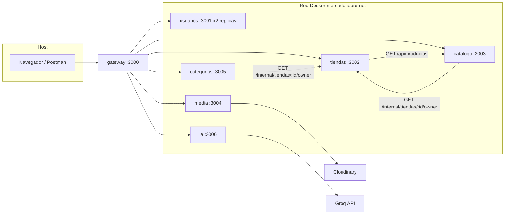

# Guía de resiliencia y monitoreo — Equipo Mercado Liebre

Documento para la **sustentación del tercer corte**. Explica cómo funcionan los **logs**, el **circuit breaker**, los **health checks** y el estado **half-open**, con foco en **dónde está cada cosa** y **qué debe explicar cada integrante**.

---

## Distribución del equipo

| Integrante | Microservicios | Puerto interno | Base de datos |
|------------|----------------|----------------|---------------|
| **Json** | Usuarios, Tiendas | 3001, 3002 | `db-usuarios`, `db-tiendas` |
| **Ulkin** | Catálogo, Categorías | 3003, 3005 | `db-catalogo`, `db-categorias` |
| **Brayan** | Media, IA | 3004, 3006 | `db-media`, `db-ia` |

**Compartido por todos:** `packages/resilience/`, rutas de health en cada servicio, gateway Nginx (`gateway/nginx.conf`).

---

## 1. Vista general: cómo se comunica el sistema



### Regla importante

- **El cliente nunca llama directo a un microservicio.** Todo pasa por el gateway: `http://localhost:3000/api/...`
- **Entre microservicios** se usan nombres Docker (`http://tiendas-service:3002`, etc.) definidos en `docker-compose.yml` y `src/config.js` de cada servicio.
- **Rutas internas** (`/internal/*`) solo las consumen otros servicios, con header `X-Internal-Token` (no el JWT del usuario).

---

## 2. Paquete compartido: `packages/resilience/`

Todos los microservicios importan `@mercadoliebre/resilience`. Es el **mismo contrato** en los 6 servicios.

| Archivo | Qué hace |
|---------|----------|
| `circuit-breaker.js` | Logs de transiciones del breaker (open, half_open, closed, reject, timeout) |
| `health.js` | `pingDb`, `buildHealthPayload`, `getBreakerState` (estado + contadores) |
| `breaker-control.js` | `POST /api/health/breakers/control` para laboratorio (forzar open/close/half_open) |
| `index.js` | Re-exporta todo lo anterior |

### Estados del circuit breaker (Opossum)

```
CLOSED (cerrado)     → tráfico normal; todo funciona.
        ↓ muchos fallos (volumeThreshold + errorThresholdPercentage)
OPEN (abierto)       → rechaza llamadas sin ir al backend; respuesta rápida 503.
        ↓ pasa resetTimeout (ej. 15 s)
HALF-OPEN (semiabierto) → permite UNA petición de prueba.
        ↓ éxito → CLOSED  |  fallo → OPEN otra vez
```

**Half-open en una frase para la sustentación:**  
*"Después del tiempo de enfriamiento, el sistema prueba con una sola llamada si el servicio dependiente ya se recuperó; si funciona, vuelve a cerrar el circuito."*

Parámetros típicos (en `src/config.js` de cada servicio, clave `CIRCUIT_BREAKER`):

| Parámetro | Significado |
|-----------|-------------|
| `timeout` | Máximo de ms por llamada antes de contar como fallo |
| `errorThresholdPercentage` | % de errores para considerar abrir el circuito |
| `resetTimeout` | Ms en OPEN antes de pasar a HALF-OPEN |
| `volumeThreshold` | Mínimo de llamadas antes de evaluar abrir |

---

## 3. Logs (todos los servicios)

### Dónde está

Cada microservicio tiene:

```
microservices/servicio-XXX/src/logger.js   → Pino + pino-http
microservices/servicio-XXX/src/index.js    → monta httpLogger
```

### Cómo funcionan

1. **Pino** escribe JSON estructurado a stdout (Docker lo captura).
2. Cada log lleva `service: "nombre-service"` (ej. `catalogo-service`).
3. En rutas HTTP, `req.log` incluye `requestId` para seguir una petición.
4. Eventos del breaker usan `event: 'circuit_breaker'` y `state: 'open' | 'half_open' | 'closed'`.

### Cómo verlos

```powershell
# Desde la raíz Mercado_Liebre/
docker compose logs usuarios-service --tail 50
docker compose logs catalogo-service --tail 50
```

### Qué decir en la sustentación

*"Usamos Pino para logs estructurados: cada microservicio etiqueta su nombre, las rutas tienen requestId, y cuando el circuit breaker cambia de estado dejamos un log con `event: circuit_breaker` para auditar open, half-open y closed."*

---

## 4. Health checks (todos los servicios)

### Dónde está

```
microservices/servicio-XXX/src/routes/health.routes.js
```

### Endpoints (por microservicio, vía gateway)

| Ruta en gateway | Qué devuelve |
|-----------------|--------------|
| `GET /api/health` | Estado del gateway + estrategia de balanceo |
| `GET /api/health/usuarios` | Health de usuarios (réplica al azar) |
| `GET /api/health/tiendas` | Health de tiendas |
| `GET /api/health/catalogo` | Health de catálogo |
| `GET /api/health/categorias` | Health de categorías |
| `GET /api/health/media` | Health de media |
| `GET /api/health/ia` | Health de IA |
| `GET /api/health/breakers/{servicio}` | Solo estado de breakers |
| `POST /api/health/breakers/control/{servicio}` | Laboratorio: forzar open/close/half_open |

### Semántica de `status` en el JSON

| Valor | Significado |
|-------|-------------|
| `ok` | BD responde y todos los breakers en `closed` |
| `degraded` | BD OK pero algún breaker no está `closed` |
| `down` | La BD no responde |

También incluye: `db.latency_ms`, `breakers[].state`, `breakers[].stats` (successes, failures, rejects, timeouts).

### Ejemplo rápido

```http
GET http://localhost:3000/api/health/catalogo
```

---

## 5. Monitoreo (gateway + Docker)

### Qué usar

Health checks y breakers se consultan por el **gateway** (`http://localhost:3000`). Los logs salen con **`docker compose logs`**.

### Comandos útiles

```bash
docker compose ps
docker compose logs -f usuarios-service
docker compose logs catalogo-service 2>&1 | findstr circuit_breaker
```

### Token de laboratorio

En `.env`: `OPS_PANEL_TOKEN` (o `OPS_LAB_TOKEN`).

Header obligatorio en control manual:

```http
POST http://localhost:3000/api/health/breakers/control/tiendas
X-Ops-Lab-Token: <valor de OPS_PANEL_TOKEN>
Content-Type: application/json

{"action":"open","name":"tiendas-catalogo-productos"}
```

Acciones: `open`, `close`, `half_open`.

---

## 6. Json — Usuarios y Tiendas

### Carpetas y archivos clave

**Usuarios** (`microservices/servicio-usuarios/`):

| Archivo | Rol |
|---------|-----|
| `src/breakers.js` | Breaker `usuarios-mysql` sobre consultas SQL |
| `src/routes/auth.routes.js` | Registro, login, `/api/auth/me` |
| `src/routes/health.routes.js` | Health + control de breaker |
| `src/config.js` | `INSTANCE_ID` para balanceo (usuarios-1 / usuarios-2) |

**Tiendas** (`microservices/servicio-tiendas/`):

| Archivo | Rol |
|---------|-----|
| `src/breakers.js` | Breaker `tiendas-catalogo-productos` |
| `src/clients/catalogo.client.js` | Llama a catálogo para vista pública |
| `src/routes/tiendas.routes.js` | CRUD tiendas + `GET /:id/vista-publica` |
| `src/routes/internal.routes.js` | `GET /internal/tiendas/:id/owner` (para Ulkin) |
| `src/middleware/internalAuth.js` | Valida `X-Internal-Token` |

### Circuit breaker de Json

| Servicio | Nombre del breaker | Protege |
|----------|-------------------|---------|
| Usuarios | `usuarios-mysql` | Pool MySQL (login/registro) |
| Tiendas | `tiendas-catalogo-productos` | HTTP → `catalogo-service` al armar vista pública |

### Comunicación de Json con el resto

```
Cliente → gateway → usuarios (auth, JWT)
Cliente → gateway → tiendas (CRUD tienda)

Ulkin (catálogo/categorías) → tiendas: GET /internal/tiendas/:id/owner
Json (tiendas) → Ulkin (catálogo): GET /api/productos?tienda_id=...  (vista pública)
```

### Balanceo de carga (solo Usuarios)

En `docker-compose.yml` hay **dos réplicas**: `usuarios-service` y `usuarios-service-2`.  
En `gateway/nginx.conf`, `upstream usuarios_upstream` reparte en **round-robin**.

**Demostración en sustentación:**

```powershell
1..20 | ForEach-Object {
  (Invoke-RestMethod "http://localhost:3000/api/health/usuarios").instance_id
} | Group-Object
```

Debe alternar `usuarios-1` y `usuarios-2`.

### Qué explica Json en la sustentación

1. **Usuarios:** registro/login, JWT, breaker sobre MySQL; si la BD cae, login responde 503 con `reason: circuit_open` en lugar de colgar.
2. **Tiendas:** dueño crea tienda en su BD; vista pública **compone** datos llamando a catálogo (integración entre servicios).
3. **Ruta interna:** catálogo y categorías preguntan “¿quién es el dueño?” a `internal.routes.js`; Json no expone eso al navegador.
4. **Balanceo:** dos réplicas de usuarios detrás del gateway.

### Pruebas que Json puede ejecutar en vivo

```powershell
# Health usuarios (ver instance_id y breaker mysql)
Invoke-RestMethod http://localhost:3000/api/health/usuarios

# Abrir breaker MySQL (laboratorio) — luego intentar login
# POST /api/health/breakers/control/usuarios con action open

# Vista pública (integración con catálogo de Ulkin)
Invoke-RestMethod http://localhost:3000/api/tiendas/<TIENDA_ID>/vista-publica

# Forzar fallo de catálogo: docker stop mercadoliebre_catalogo
# La vista pública debe degradarse con error controlado, no timeout infinito
```

### Respuesta típica con circuito abierto (usuarios)

```json
{
  "error": "Servicio temporalmente protegido (circuit breaker sobre base de datos)",
  "reason": "circuit_open"
}
```

---

## 7. Ulkin — Catálogo y Categorías

### Carpetas y archivos clave

**Catálogo** (`microservices/servicio-catalogo/`):

| Archivo | Rol |
|---------|-----|
| `src/breakers.js` | Breaker `catalogo-tiendas-owner` |
| `src/clients/tiendas.client.js` | `isOwnerOfTienda()` → llama a tiendas |
| `src/routes/productos.routes.js` | GET/POST productos |
| `src/routes/health.routes.js` | Health |

**Categorías** (`microservices/servicio-categorias/`):

| Archivo | Rol |
|---------|-----|
| `src/breakers.js` | Breaker `categorias-tiendas-owner` |
| `src/clients/tiendas.client.js` | Igual patrón que catálogo |
| `src/routes/categorias.routes.js` | GET/POST categorías |

### Circuit breaker de Ulkin

| Servicio | Nombre del breaker | Protege |
|----------|-------------------|---------|
| Catálogo | `catalogo-tiendas-owner` | Validar dueño en tiendas antes de crear/editar producto |
| Categorías | `categorias-tiendas-owner` | Igual, antes de crear/editar categoría |

**Importante:** el breaker **no protege la BD local** de catálogo/categorías en el código actual; protege la **dependencia HTTP hacia tiendas** (servicio de Json).

### Flujo al crear un producto (POST)

```
1. Cliente → gateway → catalogo-service (JWT en Authorization)
2. catalogo → tiendas-service: GET /internal/tiendas/:tiendaId/owner
   Header: X-Internal-Token: <INTERNAL_SERVICE_TOKEN>
3. Si usuario_id coincide con JWT → INSERT en db-catalogo
4. Si tiendas no responde o breaker OPEN → isOwnerOfTienda() = false → HTTP 403 (sin tumbar el proceso)
```

### Comunicación de Ulkin

```
Ulkin (catálogo)  ──HTTP──►  Json (tiendas)   validar dueño
Json (tiendas)    ──HTTP──►  Ulkin (catálogo)  listar productos (vista pública)
```

Ulkin **no llama** a Media ni IA directamente.

### Qué explica Ulkin en la sustentación

1. **Dominio propio:** productos y categorías en BDs separadas (`catalogo_db`, `categorias_db`).
2. **Integración:** antes de escribir, validan ownership vía tiendas (Json); es **comunicación HTTP entre microservicios**.
3. **Resiliencia:** si tiendas cae, el breaker `*-tiendas-owner` se abre; catálogo/categorías dejan de martillar tiendas y responden controlado.
4. **Lecturas públicas:** `GET /api/productos?tienda_id=` no necesita validar dueño (listado); la validación es en POST/PATCH/DELETE.

### Pruebas que Ulkin puede ejecutar en vivo

```powershell
# Health y estado del breaker hacia tiendas
Invoke-RestMethod http://localhost:3000/api/health/catalogo
Invoke-RestMethod http://localhost:3000/api/health/breakers/catalogo

# Listar productos (GET)
Invoke-RestMethod "http://localhost:3000/api/productos?tienda_id=<ID>"

# Simular tiendas caído
docker stop mercadoliebre_tiendas
# Intentar POST producto con JWT → debe fallar validación / 403
# Ver logs: reason circuit_open o upstream_error

docker start mercadoliebre_tiendas

# Laboratorio: forzar breaker abierto sin apagar contenedor
# POST /api/health/breakers/control/catalogo
# Body: {"action":"open","name":"catalogo-tiendas-owner"}
```

### Guion corto para Ulkin

*"Mi servicio de catálogo persiste productos en su MySQL, pero antes de crear uno pregunta a tiendas si el usuario autenticado es dueño. Esa llamada va detrás de un circuit breaker: si tiendas falla muchas veces, el circuito se abre, registramos el evento en logs y no seguimos enviando tráfico hasta el half-open."*

---

## 8. Brayan — Media e IA

### Carpetas y archivos clave

**Media** (`microservices/servicio-media/`):

| Archivo | Rol |
|---------|-----|
| `src/breakers.js` | Breaker `media-cloudinary-upload` |
| `src/clients/cloudinary.client.js` | `uploadImage()` vía breaker |
| `src/routes/media.routes.js` | `POST /api/media/upload` |
| `src/routes/health.routes.js` | Health |

**IA** (`microservices/servicio-ia/`):

| Archivo | Rol |
|---------|-----|
| `src/breakers.js` | Breaker `ia-groq` |
| `src/clients/groq.client.js` | `generate()` vía breaker |
| `src/routes/ia.routes.js` | `POST /api/ia/generar` |
| `src/routes/health.routes.js` | Health |

### Circuit breaker de Brayan

| Servicio | Nombre del breaker | Protege |
|----------|-------------------|---------|
| Media | `media-cloudinary-upload` | API externa **Cloudinary** |
| IA | `ia-groq` | API externa **Groq** |

Son breakers hacia **SaaS externos**, no hacia otro microservicio del equipo.

### Variables de entorno (Brayan debe conocerlas)

En `.env` / `.env.example`:

```env
# Media
CLOUDINARY_CLOUD_NAME=...
CLOUDINARY_API_KEY=...
CLOUDINARY_API_SECRET=...

# IA
GROQ_API_KEY=...
GROQ_MODEL=llama-3.3-70b-versatile
```

Sin keys, los POST responden **503** (“no configurado”), pero **health sigue en ok** si la BD local responde.

### Persistencia (auditoría)

| Servicio | Tabla | Qué guarda |
|----------|-------|------------|
| Media | `media_assets` | URL Cloudinary, usuario, mime, tamaño |
| IA | `ia_generaciones` | prompt, respuesta o error, modelo |

### Comunicación de Brayan

```
Cliente → gateway → media-service → Cloudinary (internet)
Cliente → gateway → ia-service    → Groq API (internet)
```

Media e IA **no llaman** a tiendas/catálogo en el backend actual. El front puede usar las URLs generadas en otros flujos.

### Qué explica Brayan en la sustentación

1. **Integraciones externas:** Cloudinary y Groq pueden fallar o tardar; el breaker evita reintentos en cascada.
2. **Seguridad:** `GROQ_API_KEY` y credenciales Cloudinary **solo en el contenedor**, nunca en el navegador.
3. **Trazabilidad:** cada subida/generación se audita en MySQL propio.
4. **Half-open:** tras `resetTimeout`, una subida/generación de prueba puede cerrar el circuito si el proveedor respondió bien.

### Pruebas que Brayan puede ejecutar en vivo

```powershell
# Health (breaker + latencia BD local)
Invoke-RestMethod http://localhost:3000/api/health/media
Invoke-RestMethod http://localhost:3000/api/health/ia

# Estado del breaker
Invoke-RestMethod http://localhost:3000/api/health/breakers/media

# Forzar circuito abierto (laboratorio)
# POST /api/health/breakers/control/media
# {"action":"open","name":"media-cloudinary-upload"}

# Logs del servicio
docker compose logs media-service --tail 30
docker compose logs ia-service --tail 30
```

`POST /api/media/upload` y `POST /api/ia/generar` requieren **JWT** (mismo token que login de Json).

### Guion corto para Brayan

*"Media e IA son microservicios con su propia base de datos de auditoría. La lógica de negocio llama a proveedores externos detrás de Opossum: si Cloudinary o Groq fallan repetidamente, abrimos el circuito, logueamos la transición y devolvemos 503 al cliente sin saturar al proveedor caído."*

---

## 9. Tabla resumen de breakers (todos)

| Servicio | Breaker | Dependencia | Responsable |
|----------|---------|-------------|---------------|
| usuarios | `usuarios-mysql` | MySQL local | Json |
| tiendas | `tiendas-catalogo-productos` | HTTP → catálogo | Json |
| catalogo | `catalogo-tiendas-owner` | HTTP → tiendas | Ulkin |
| categorias | `categorias-tiendas-owner` | HTTP → tiendas | Ulkin |
| media | `media-cloudinary-upload` | Cloudinary | Brayan |
| ia | `ia-groq` | Groq | Brayan |

---

## 10. Cómo demostrar HALF-OPEN en la sustentación

**Opción A — API manual (recomendada)**

```http
POST http://localhost:3000/api/health/breakers/control/tiendas
X-Ops-Lab-Token: <OPS_PANEL_TOKEN>
Content-Type: application/json

{"action":"half_open","name":"tiendas-catalogo-productos"}
```

Luego:

```http
GET http://localhost:3000/api/tiendas/<id>/vista-publica
```

Y revisar:

```http
GET http://localhost:3000/api/health/breakers/tiendas
```

---

## 11. Mapa de rutas del gateway (referencia rápida)

| Prefijo cliente | Microservicio |
|-----------------|---------------|
| `/api/auth/*`, `/api/login`, `/api/registro` | usuarios (balanceado) |
| `/api/tiendas`, `/api/temas` | tiendas |
| `/api/productos` | catálogo |
| `/api/categorias` | categorías |
| `/api/media/*` | media |
| `/api/ia/*` | ia |
| `/api/health/*` | según segmento (ver sección 4) |

Configuración: `gateway/nginx.conf`.

---

## 12. Checklist por integrante (antes de sustentar)

### Json
- [ ] Explicar JWT y registro/login
- [ ] Mostrar `instance_id` en balanceo (2 réplicas)
- [ ] Demostrar vista pública llamando a catálogo
- [ ] Explicar ruta `/internal/tiendas/:id/owner` para Ulkin
- [ ] Mostrar log o health con breaker `usuarios-mysql` o `tiendas-catalogo-productos`

### Ulkin
- [ ] Explicar POST producto con validación a tiendas
- [ ] Mostrar GET productos por `tienda_id`
- [ ] Demostrar breaker `catalogo-tiendas-owner` (tiendas caído o forzado open)
- [ ] Misma lógica para categorías

### Brayan
- [ ] Explicar variables Cloudinary / Groq en `.env`
- [ ] Mostrar health de media e ia con stats del breaker
- [ ] Explicar auditoría en `media_assets` / `ia_generaciones`
- [ ] Demostrar 503 con circuito abierto en upload o generar

### Todos
- [ ] Saber leer `GET /api/health/<su-servicio>`
- [ ] Saber ver logs con `docker compose logs <servicio>`
- [ ] Saber explicar closed → open → half-open → closed en una frase

---

## 13. Documentación relacionada

| Archivo | Contenido |
|---------|-----------|
| `../README.md` | Arquitectura completa y ejecución |
| `../docs/GUIA_RESILIENCIA_MICROSERVICIOS.md` | Detalle técnico por escenario |
| `../postman/Mercado_Liebre_API.postman_collection.json` | Colección de pruebas HTTP |
| `packages/resilience/` | Código fuente compartido |

---

*Última actualización: alineado con el stack Docker Compose de Mercado Liebre (6 microservicios + gateway).*
