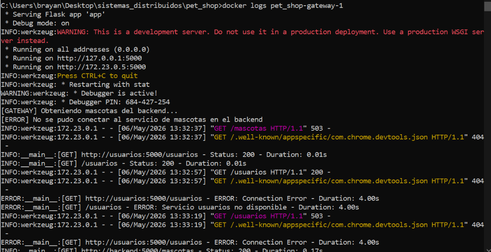
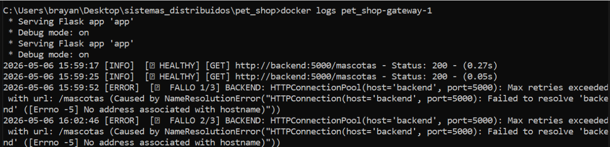
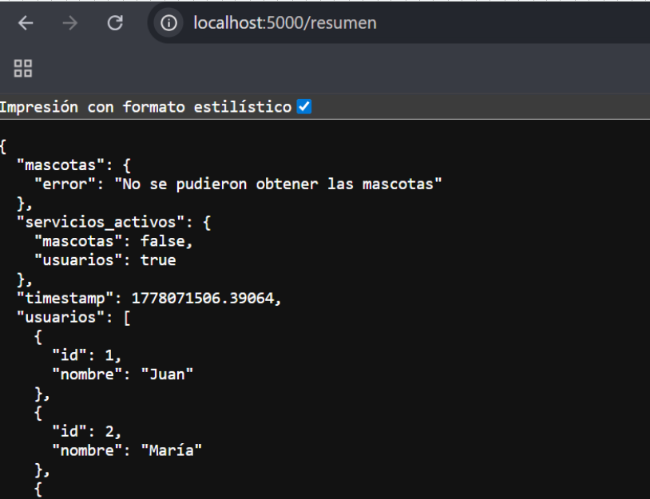
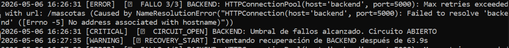
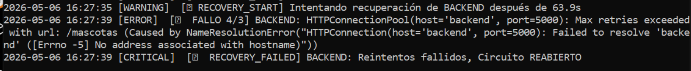
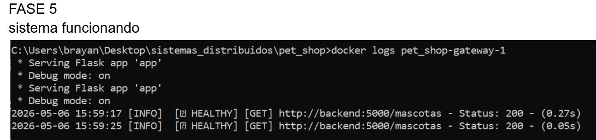
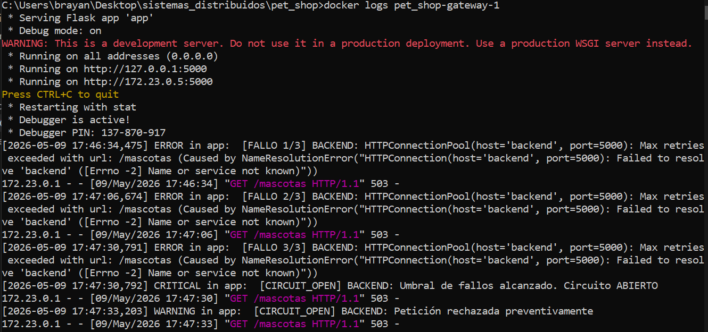
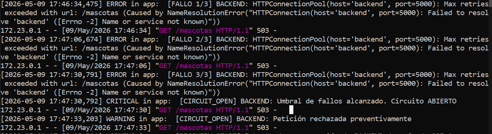
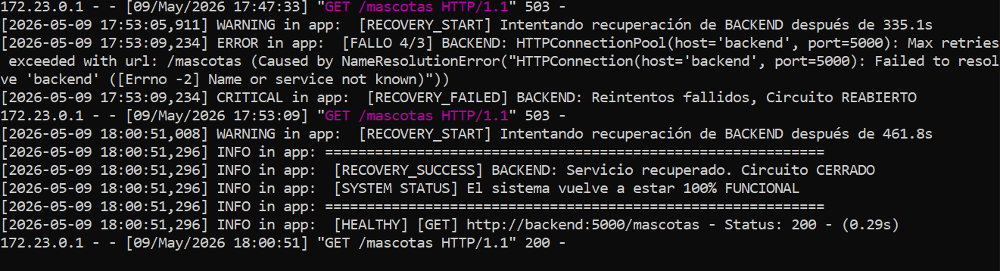

# Laboratorio: Sistema que aprende a fallar

##  FASE 1

### Procedimiento
1. Servicio de mascotas funcionando normalmente
2. Apagar el contenedor de backend
3. Hacer varias peticiones al gateway (`/mascotas`, `/resumen`)
4. Revisar logs y comportamiento


### Respuestas

**¿Qué hace el sistema actualmente?**

Sin implementar circuit breaker, el sistema:
-  **Insiste en conectar continuamente** al servicio caído
-  Cada petición genera un timeout o error de conexión
-  El cliente recibe errores 503 después de esperar (timeout x petición)
-  Consume recursos innecesarios en intentos condenados al fracaso
-  Si hay múltiples clientes, la carga se multiplica

**¿Se protege o insiste?**

**Resultado: INSISTE** 
- Sin protección contra cascadas de fallos
- Sin protección contra sobrecarga al servicio caído
- Sin mecanismo de recuperación automática

---

## **FASE 2 – APLICAR (Extensión del Circuit Breaker)**

### Decisiones de diseño

#### **1. ¿Cada servicio debe tener su propio contador de fallos?**
 **SÍ - se define que cada servicio es independiente**

```python
circuitos = {
    "backend": {
        "estado": CIRCUIT_CLOSED,
        "fallos": 0,
        "umbral_fallos": 3,
        "tiempo_apertura": None
    },
    "usuarios": {
        "estado": CIRCUIT_CLOSED,
        "fallos": 0,
        "umbral_fallos": 3,
        "tiempo_apertura": None
    }
}
```


**Razón:** 
- Un servicio puede estar caído mientras otro funciona
- No afectar a usuarios funcionales si backend falla
- Independencia en la recuperación

#### **2. ¿El circuito debe abrirse de forma independiente por servicio?**
 **SÍ**

Cada servicio tiene su propio estado:
- `/usuarios` → circuito separado para servicio "usuarios"
- `/mascotas` y `/mascotas/<id>` → circuito compartido para "backend"
- `/resumen` → usa circuitos de ambos servicios

#### **3. ¿Qué pasa si falla un servicio pero el otro sigue funcionando?**

En `/resumen`:
```python
if usuarios_circuito["estado"] == CIRCUIT_OPEN:
    usuarios_response = None  # Rechaza inmediatamente
else:
    usuarios_response = service_request_with_circuit(...)  # Intenta conectar

if mascotas_response and mascotas_response.status_code == 200:
    mascotas_data = mascotas_response.json()
else:
    mascotas_data = {"error": "No se pudieron obtener las mascotas"}
```

**Resultado:**
- Si usuarios falla → `/resumen` devuelve usuarios con error pero mascotas funciona
- Si backend falla → `/resumen` devuelve backend con error pero usuarios funciona
- El cliente siempre recibe una respuesta (parcial si es necesario)


### Endpoints protegidos

| Endpoint | Servicio | Protección |
|----------|----------|-----------|
| `/usuarios` | usuarios | Circuit breaker independiente |
| `/mascotas` | backend | Circuit breaker compartido |
| `/mascotas/<id>` | backend | Circuit breaker compartido |
| `/resumen` | ambos | Circuitos independientes |

---

## **FASE 3 – INVESTIGAR (Half-Open)**

### ¿Qué significa "half-open"?

Es el **estado intermedio** en el patrón Circuit Breaker con 3 estados:

```
CLOSED (normal)
   ↓ (3 fallos consecutivos)
OPEN (rechazando)
   ↓ (espera + timeout)
HALF-OPEN (reintentando)
   ↓
   ├─  Éxito → CLOSED
   └─  Fallo → OPEN (reinicia)
```


### ¿Cuándo se vuelve a intentar una llamada?

En el sistema:
```python
def check_recovery_timeout(service):
    circuito = circuitos.get(service)
    if circuito["estado"] != CIRCUIT_OPEN:
        return False
    
    tiempo_desde_apertura = time.time() - circuito["tiempo_apertura"]
    if tiempo_desde_apertura >= TIMEOUT_RECUPERACION:  # 10 segundos
        circuito["estado"] = CIRCUIT_HALF_OPEN
        return True
    return False
```

**Cuándo:** Después de **10 segundos** desde que se abrió el circuito

**Cómo:** En el siguiente request que arrive después de los 10s

**Quién:** El cliente que intenta la petición

### ¿Qué pasa si el servicio vuelve a fallar?

```python
if circuito["estado"] == CIRCUIT_HALF_OPEN:
    # ... intenta petición ...
    print(f"[RECOVERY EXITOSA] {service}: circuito cerrado")  
    # O
    print(f"[RECOVERY FALLIDA] {service}: circuito reabierto")  
    circuito["estado"] = CIRCUIT_OPEN
    circuito["tiempo_apertura"] = time.time()  # Reinicia timer
```

**Resultado:** El circuito se vuelve a abrir y espera otros 10 segundos

---

## **FASE 4 – IMPLEMENTAR (Recuperación)**

### Espera controlada

```python
TIMEOUT_RECUPERACION = 10  # segundos
```

**Decisión tomada:** 10 segundos de espera antes de reintentar
- Suficiente para que un servicio se reinicie
- No tan largo para afectar la experiencia del usuario

### Nuevo intento de conexión

En estado HALF-OPEN:
```python
try:
    response = requests.get(url, timeout=2)  # Intento único
    
    # Si funciona:
    if circuito["estado"] == CIRCUIT_HALF_OPEN:
        print(f"[RECOVERY EXITOSA] {service}: circuito cerrado")
        circuito["estado"] = CIRCUIT_CLOSED
        circuito["fallos"] = 0
```

### Decisión: Cerrar o reabrir

```python
except Exception as e:
    if circuito["estado"] == CIRCUIT_HALF_OPEN:
        print(f"[RECOVERY FALLIDA] {service}: circuito reabierto")
        circuito["estado"] = CIRCUIT_OPEN  # ← Reabrir
        circuito["tiempo_apertura"] = time.time()  # ← Restart timer
```

### Flujo completo de recuperación

```
1. Estado CLOSED - Funcionando normalmente
   Fallo 1/3 ✗
   Fallo 2/3 ✗
   Fallo 3/3 ✗
   
2. Estado OPEN - Circuito abierto
   [CIRCUITO ABIERTO] backend: petición rechazada
   [CIRCUITO ABIERTO] backend: petición rechazada
   ... (esperando 10 segundos) ...
   
3. Estado HALF-OPEN - Intentando recuperación
   [RECOVERY] Intentando recuperación después de 10.0s 
   
4a. Recuperación exitosa → CLOSED
   [RECOVERY EXITOSA] backend: circuito cerrado
   Vuelto a CLOSED, contadores en 0
   
4b. Recuperación fallida → OPEN
   [RECOVERY FALLIDA] backend: circuito reabierto
   Vuelto a OPEN, espera otros 10s
```

---

## **FASE 5 – VALIDAR (Escenarios)**

### Escenario 1: Servicio funcionando 

**Comportamiento esperado:**
- Estado: CLOSED
- Respuestas: 200 OK
- Contador fallos: 0

```
GET /mascotas
→ [GET] http://backend:5000/mascotas - Status: 200
→ {datos de mascotas}
```


### Escenario 2: Servicio caído 

**Comportamiento esperado:**
- Fallo 1: Intenta, error, contador = 1
- Fallo 2: Intenta, error, contador = 2
- Fallo 3: Intenta, error, contador = 3 → **ABRE CIRCUITO**
- Fallo 4+: Rechaza sin intentar

```
GET /mascotas (intento 1)
→ [FALLO 1/3] backend: Connection Error
→ 503 servicio no disponible

GET /mascotas (intento 2)
→ [FALLO 2/3] backend: Connection Error
→ 503 servicio no disponible

GET /mascotas (intento 3)
→ [FALLO 3/3] backend: Connection Error
→ [CIRCUITO ABIERTO] backend: umbral alcanzado
→ 503 servicio no disponible

GET /mascotas (intento 4)
→ [CIRCUITO ABIERTO] backend: petición rechazada
→ 503 (sin intentar conexión)
```


### Escenario 3: Circuito abierto 

**Comportamiento esperado:**
- Estado: OPEN
- Rechaza inmediatamente sin timeout
- No consume recursos en el servicio caído
- Timer esperando recuperación

```
GET /mascotas
→ [CIRCUITO ABIERTO] backend: petición rechazada
→ 503 (respuesta inmediata, sin timeout)
```


### Escenario 4: Recuperación del servicio 

**Etapa 1: Esperando timeout (0-10 segundos)**
```
Tiempo 0s: Circuito abierto, rechazando
Tiempo 5s: Aún abierto, rechazando
Tiempo 10s: Condición cumplida
```

**Etapa 2: Transición a Half-Open (10s)**
```
GET /mascotas (en segundo 10+)
→ [RECOVERY] Intentando recuperación después de 10.0s
→ Estado: HALF-OPEN
→ Intenta conexión...
```

**Etapa 3a: Éxito → CLOSED**
```
→ Conexión exitosa (servicio reiniciado)
→ [RECOVERY EXITOSA] backend: circuito cerrado
→ Estado: CLOSED
→ Fallos: 0
→ Respuesta: 200 OK con datos
```

**Etapa 3b: Fallo → OPEN nuevamente**
```
→ Conexión fallida (servicio aún está caído)
→ [RECOVERY FALLIDA] backend: circuito reabierto
→ Estado: OPEN
→ Tiempo apertura: reiniciado
→ Respuesta: 503 (sin timeout)
→ Espera otros 10 segundos antes de reintentar
```

---

## **ANÁLISIS FINAL**

### ¿Qué cambió en el comportamiento del sistema?

| Aspecto | Sin Circuit Breaker | Con Circuit Breaker |
|--------|-------------------|-------------------|
| **Cuando falla un servicio** | Intenta siempre (timeout x petición) | Abre circuito, rechaza rápido |
| **Tiempo de respuesta en fallo** | 2-5 segundos (timeout) | 50ms (rechazo inmediato) |
| **Carga en servicio caído** | Alta (intentos continuos) | Baja (rechazos sin conexión) |
| **Recuperación automática** | No | Sí (cada 10s después de apertura) |
| **Comportamiento en half-open** | N/A | Reintenta si espera se cumple |
| **Independencia de servicios** | No | Sí (cada servicio su circuito) |

### ¿Qué decisiones tomaron en la implementación?

1. **Circuitos independientes por servicio**
   - Decisión: Sí
   - Razón: Aislar fallos, no afectar servicios funcionales

2. **Timeout de recuperación**
   - Decidido: 10 segundos
   - Razón: Balance entre recuperación rápida y dar tiempo al servicio

3. **Umbrales de fallo**
   - Decidido: 3 fallos
   - Razón: Evitar falsos positivos, permitir fallos temporales

4. **Comportamiento en /resumen con servicios mixtos**
   - Decidido: Devolver respuesta parcial
   - Razón: Si un servicio falla, otros siguen siendo útiles

5. **Timeout de petición**
   - Decidido: 2 segundos
   - Razón: Detección rápida de problemas

### ¿Qué dificultades encontraron?

1. **Variables globales vs estado compartido**
   - Desafío: Múltiples endpoints comparten estado de circuitos
   - Solución: Usar diccionario `circuitos` con estado centralizado

2. **Race conditions en estado Half-Open**
   - Desafío: Múltiples requests podrían intentar recuperación simultáneamente
   - Nota: En aplicación con threading, se requeriría locking

3. **Decidir independencia de servicios en /resumen**
   - Desafío: ¿Rechazar todo si uno falla o devolver parcialmente?
   - Solución: Devolver respuesta parcial, usuario ve qué falló

4. **Configuración correcta del timeout**
   - Desafío: 10 segundos ¿suficiente para reinicio?
   - Solución: Configurable, ajustable según infraestructura

5. **Logs informativos sin contaminar mucho**
   - Desafío: Balance entre visibilidad y ruido en logs
   - Solución: Prefijos como [RECOVERY], [CIRCUITO ABIERTO]

---
