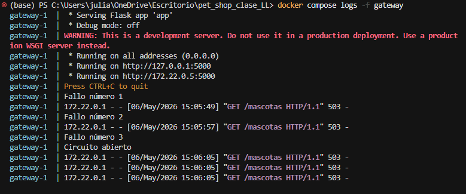
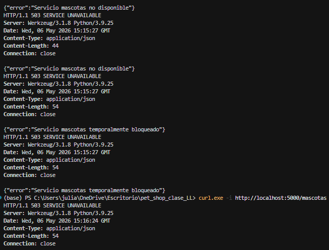
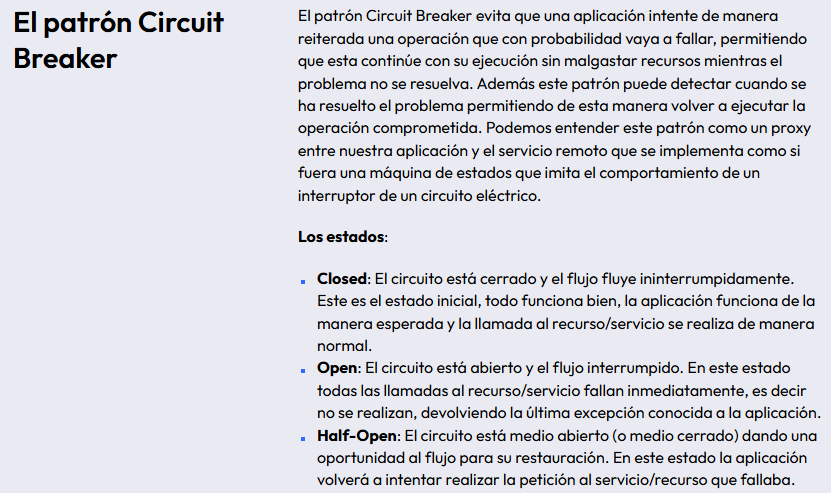
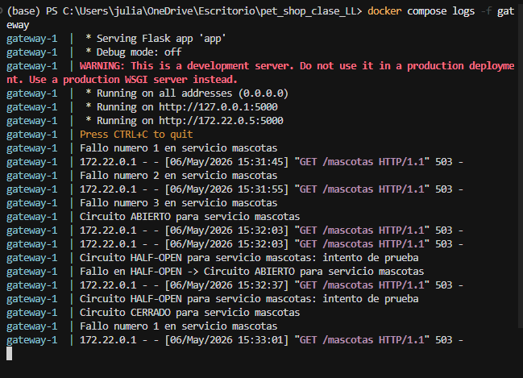
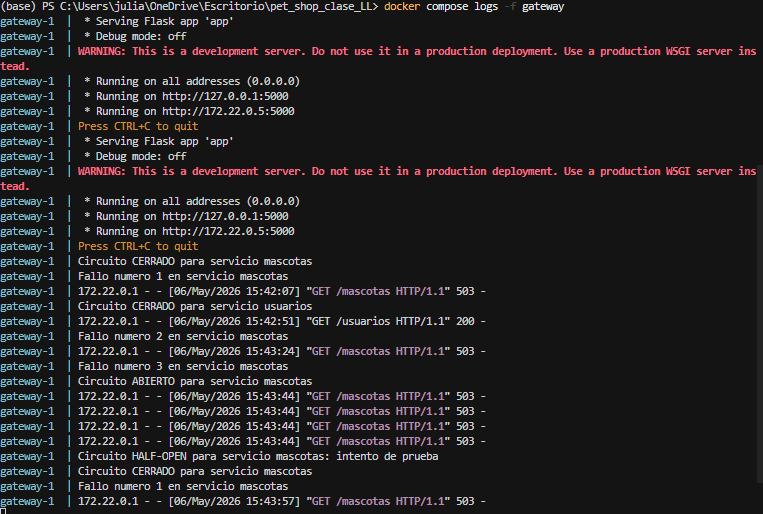

# Laboratorio: Sistema que aprende a fallar

## Checklist frente a la rúbrica (entrega)

| Requisito | Estado en este repo |
|-----------|---------------------|
| `/corte_3/laboratorio_circuit_breaker/` + README + `evidencias/` | Incluido |
| Evidencias `fase1.png` … `fase5.png` (guía) | En el repo figuran como **`Fase_1.png` … `Fase_5.png`** (mismo contenido; enlaces en README apuntan a esos nombres) |
| Fase 1: apagar mascotas, peticiones, logs, preguntas | README + `pruebas.bat fase1` |
| Fase 2: breaker en **todos** los endpoints del gateway sin copiar código; análisis contador/circuito/aislamiento | `llamar_servicio` + `/mascotas`, `/usuarios`, **`/resumen`** |
| Fase 3: half-open (qué, cuándo reintenta, si falla) | README |
| Fase 4: espera + intento + cerrar o reabrir | `TIEMPO_RECUPERACION_SEGUNDOS` + logs |
| Fase 5: 4 escenarios | `pruebas.bat fase5` (con esperas a backend/gateway para HTTP 200 cuando corresponde) |
| Código + análisis final | `gateway/app.py` + sección final del README |

**Nota Fase 1:** La consigna dice “observar sin modificar”; en la práctica el laboratorio documenta el comportamiento del **gateway ya instrumentado** con Circuit Breaker (comportamiento observable: insiste hasta umbral, luego protege).

## Galería de evidencias (capturas)

Las imágenes están en la carpeta `evidencias/`. En GitHub/GitLab se muestran automáticamente con las rutas relativas siguientes.

| Fase 1 | Fase 2 |
| :----: | :----: |
|  |  |

| Fase 3 | Fase 4 |
| :----: | :----: |
|  |  |

**Fase 5**



---

## Contexto del sistema

Este laboratorio se desarrolló sobre un gateway en Flask con endpoints:

- `/mascotas` → `http://backend:5000/mascotas`
- `/usuarios` → `http://usuarios:5000/usuarios`
- `/resumen` → agrega ambas respuestas llamando **dos veces** a `llamar_servicio` (misma lógica de breaker por servicio, sin duplicar el núcleo del patrón).

Se implementó y validó el patrón Circuit Breaker con apertura por fallos consecutivos y recuperación con estado half-open.

---

## FASE 1 - OBSERVAR (sin modificar código)

### ¿Qué se hizo?

1. Se levantaron los servicios con Docker Compose.
2. Se apagó el servicio de mascotas (`backend`).
3. Se hicieron varias peticiones al gateway en `/mascotas`.
4. Se revisaron logs del gateway.

### Comandos usados

```powershell
docker compose up -d
docker compose stop backend
for ($i=1; $i -le 5; $i++) { curl.exe -i http://localhost:5000/mascotas }
docker compose logs -f gateway
```

### ¿Qué se observó?

- Los primeros intentos devolvieron error `503` con mensaje tipo `Servicio mascotas no disponible` (JSON del gateway).
- Después de 3 fallos consecutivos, se abrió el circuito.
- Con el circuito abierto, las solicitudes siguientes devolvieron `503` con mensaje tipo `Servicio mascotas temporalmente bloqueado. Reintente en Ns`.

### Respuestas solicitadas

- **¿Qué hace el sistema actualmente?**  
  En esta fase se observó el comportamiento sobre `/mascotas`: detecta fallos consecutivos, abre el circuito y bloquea llamadas para proteger al gateway (y al backend) de reintentos constantes.

- **¿Se protege o insiste?**  
  Primero insiste hasta el umbral de fallos, luego se protege al abrir circuito.

### Evidencia

- Captura obligatoria: `evidencias/Fase_1.png`
- Incluir: peticiones fallidas + logs con `Fallo numero ...` y `Circuito ABIERTO ...`.


---

## FASE 2 - APLICAR (Extensión del Circuit Breaker)

### ¿Qué se implementó?

Se extendió el Circuit Breaker a **todos** los endpoints del gateway sin duplicar lógica, usando:

- Una función compartida: `llamar_servicio(nombre_servicio)`
- Estado independiente por servicio en un diccionario:
  - contador de fallos
  - estado del circuito
  - URL del servicio
- Ruta agregadora **`/resumen`**: compone `mascotas` + `usuarios` reutilizando `llamar_servicio` dos veces (si `mascotas` está en fallo/circuito abierto, devuelve el mismo error que `/mascotas`; no hay lógica de breaker copiada en la ruta).

### Decisiones de diseño

- **¿Cada servicio debe tener su propio contador de fallos?**  
  Sí. Se definió un contador independiente por servicio para evitar que los errores de un backend "contaminen" a los demás. Esto mejora el aislamiento de fallos.

- **¿El circuito debe abrirse de forma independiente por servicio?**  
  Sí. Cada servicio maneja su propio estado (`closed`, `open`, `half-open`) para que el gateway no bloquee todo el tráfico por la caída de un único endpoint.

- **¿Qué pasa si falla un servicio pero el otro sigue funcionando?**  
  El servicio con fallos abre su circuito y responde con bloqueo temporal (`503`), mientras los demás servicios continúan operando normalmente si están sanos.

### Validación realizada

1. Se apagó `backend` y se probó `/mascotas` (abre su circuito).
2. Se verificó que `/usuarios` podía seguir respondiendo.
3. Se apagó `usuarios` y se probó el comportamiento inverso.

### Evidencia

- Captura obligatoria: `evidencias/Fase_2.png`
- Incluir: pruebas en ambos endpoints + logs por servicio (`mascotas`, `usuarios`).


---

## FASE 3 - INVESTIGAR (Half-Open)

### ¿Qué significa half-open?

`Half-open` es un estado de prueba entre `open` y `closed`.  
Cuando el circuito estuvo abierto y ya pasó el tiempo de espera, el sistema no vuelve de inmediato al estado normal: primero habilita un intento controlado para validar si el servicio realmente se recuperó.

### ¿Cuándo se vuelve a intentar una llamada?

Se vuelve a intentar cuando vence el tiempo de recuperación configurado (`TIEMPO_RECUPERACION_SEGUNDOS`).  
En ese momento, el gateway cambia el circuito a `half-open` y permite una petición de prueba al servicio caído.

### ¿Qué pasa si el servicio vuelve a fallar?

Si la llamada de prueba falla en `half-open`, el circuito retorna a `open` de forma inmediata y reinicia la ventana de espera para evitar presión sobre un servicio inestable.  
Si la llamada de prueba funciona, el circuito pasa a `closed`, reinicia el contador de fallos y el tráfico vuelve a fluir con normalidad.

### ¿Por qué es importante este estado?

Sin `half-open`, el sistema solo tendría dos extremos: bloquear siempre o intentar siempre.  
Con `half-open`, se logra un equilibrio: se protege al backend durante la caída, pero también se permite una recuperación automática y gradual cuando el servicio vuelve.

### Evidencia

- Captura obligatoria: `evidencias/Fase_3.png`
- Incluir: explicación conceptual (puede ser del README o apoyo visual de la lógica).


---

## FASE 4 - IMPLEMENTAR (Recuperación)

### ¿Qué se implementó en código?

Se añadió lógica de recuperación con estados:

- `closed` (normal)
- `open` (bloqueo temporal)
- `half-open` (intento de prueba)

Además:

- Espera controlada con `TIEMPO_RECUPERACION_SEGUNDOS = 10`
- Reintento automático al cumplirse la espera
- Decisión automática:
  - Cerrar circuito si la prueba funciona
  - Reabrir circuito si la prueba falla

### Evidencia observada en logs

- `Circuito ABIERTO para servicio mascotas`
- `Circuito HALF-OPEN para servicio mascotas: intento de prueba`
- `Fallo en HALF-OPEN -> Circuito ABIERTO ...` (cuando aún falla)
- `Circuito CERRADO para servicio mascotas` (cuando se recupera)

### Evidencia

- Captura obligatoria: `evidencias/Fase_4.png`
- Incluir: secuencia OPEN -> HALF-OPEN -> (ABIERTO o CERRADO).


---

## FASE 5 - VALIDAR (escenarios)

Se validaron los cuatro escenarios solicitados:

1. **Servicio funcionando:** respuesta 200.
2. **Servicio caído:** respuesta 503 por indisponibilidad.
3. **Circuito abierto:** bloqueo temporal sin seguir atacando el backend.
4. **Recuperación del servicio:** transición a half-open y cierre al recuperarse.

### Comandos de prueba sugeridos

```powershell
# Funcionando (esperar unos segundos tras `docker compose up` si MySQL aún arranca)
curl.exe -i http://localhost:5000/mascotas
curl.exe -i http://localhost:5000/usuarios
curl.exe -i http://localhost:5000/resumen

# Caida de mascotas
docker compose stop backend
for ($i=1; $i -le 4; $i++) { curl.exe -i http://localhost:5000/mascotas }

# Recuperacion
docker compose start backend
# Tras MySQL listo, el gateway puede pasar por HALF-OPEN y cerrar circuito
curl.exe -i http://localhost:5000/mascotas
docker compose logs -f gateway
```

### Evidencia

- Captura obligatoria: `evidencias/Fase_5.png`
- Incluir: requests + logs mostrando los 4 escenarios.


---

## Código implementado

- Circuit Breaker en **todos** los endpoints del gateway: `/mascotas`, `/usuarios`, `/resumen`.
- Estado independiente por servicio (`mascotas` vs `usuarios`); `/resumen` respeta el estado de cada uno al llamar en secuencia.
- Lógica de recuperación (half-open) implementada y validada.

Archivo principal:

- `gateway/app.py`

---

## Análisis final

### ¿Qué cambió en el comportamiento del sistema?

El gateway dejó de depender de fallos continuos para colapsar y ahora aplica protección activa por servicio, con recuperación automática cuando el backend vuelve.

### ¿Qué decisiones se tomaron en la implementación?

- Se evitó duplicación de código usando una función compartida.
- Se aisló el estado del circuito por servicio.
- Se definió un tiempo de recuperación fijo para habilitar half-open.

### ¿Qué dificultades se encontraron?

- Manejo de tiempos en pruebas (requests justo al arrancar servicios).
- Diferenciar fallos de servicio vs bloqueos del propio circuito.
- Ordenar evidencias para mostrar claramente la transición de estados.

---

## Notas para ejecutar

Variables de entorno: copia `.env.example` a `.env` en esta carpeta (el `.env` real no se versiona).

Ejecuta `pruebas.bat` **desde la carpeta** `laboratorio_circuit_breaker` (es donde vive `docker-compose.yml`). **Cada fase (1–5)** ejecuta al inicio un reinicio de condiciones: `docker compose up -d`, servicios arriba, **`docker compose restart gateway`** (memoria del breaker limpia) y esperas activas hasta HTTP 200 en `http://localhost:5002/mascotas` (backend con MySQL listo) y en `http://localhost:5000/mascotas` (gateway), para evitar 503 falsos por arranque lento y para que cada fase arranque desde el mismo baseline aunque ejecutes `all` o fases sueltas.

```powershell
docker compose up -d --build
docker compose logs -f gateway
```

Si se necesita limpiar estado en memoria del gateway entre escenarios:

```powershell
docker compose restart gateway
```

