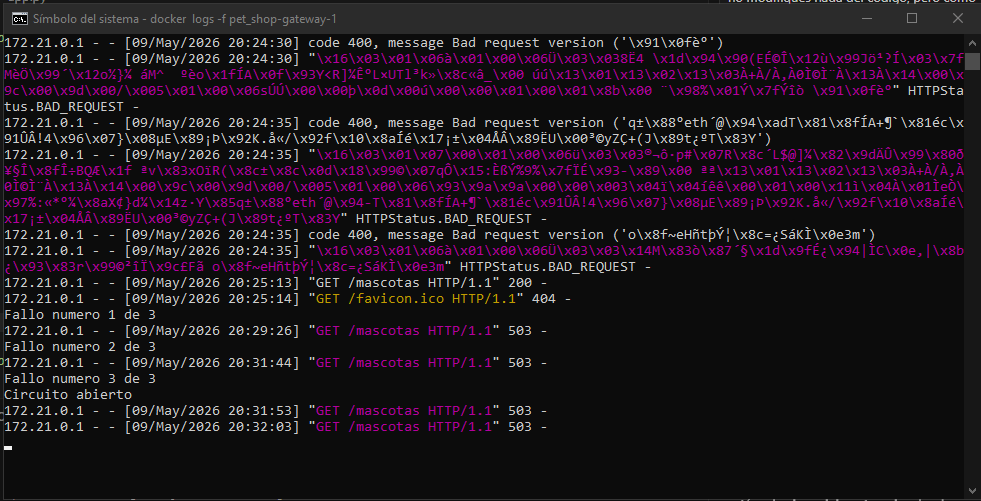
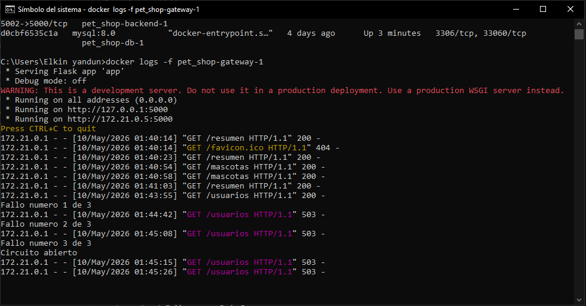
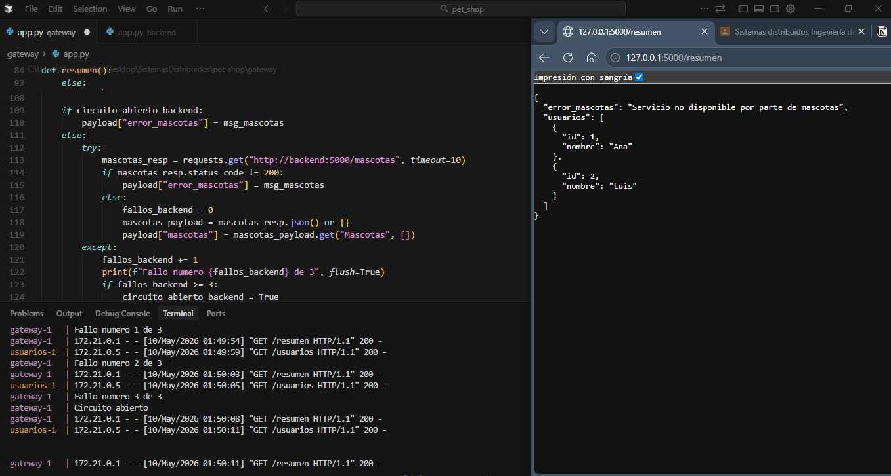
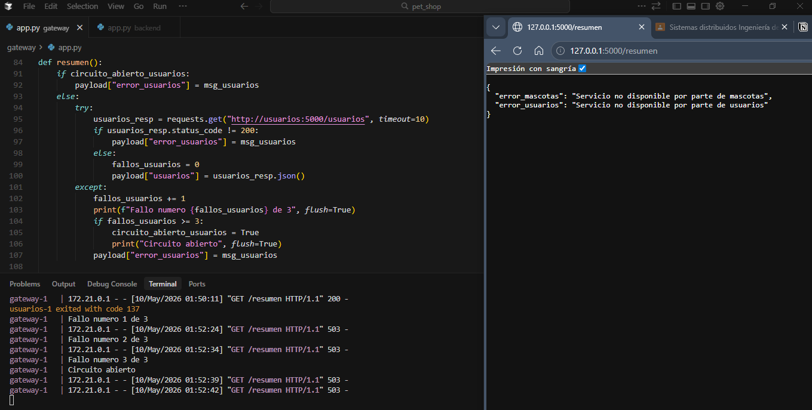
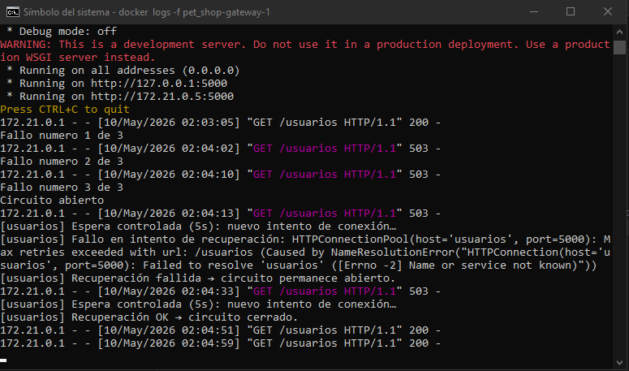
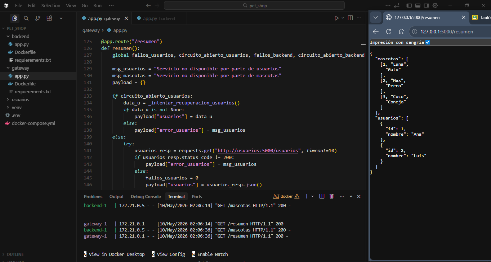
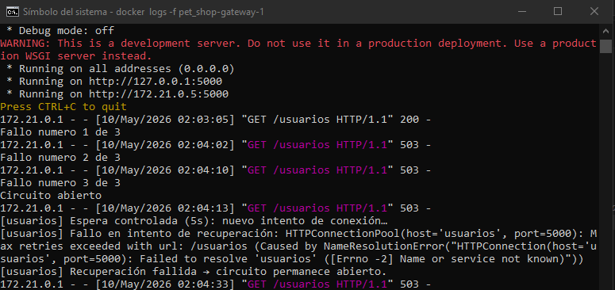

# Laboratorio: Sistema que aprende a fallar
## Pet Shop – Circuit Breaker en microservicios

---

## FASE 1 – OBSERVAR (sin modificar código)

### ¿Qué hicimos?

Levantamos todos los servicios con Docker Compose y luego **apagamos únicamente el servicio de mascotas (backend)**:

```bash
docker-compose stop backend
```

Después hicimos varias peticiones al gateway apuntando a `/mascotas`:

```bash
http://localhost:5000/mascotas
```

### ¿Qué observamos?

En las primeras peticiones el sistema respondía con un mensaje de error pero seguía intentando conectarse al backend caído. Luego de **3 fallos consecutivos**, el contador interno llegó al límite y el circuito se "abrió", lo que significa que el gateway dejó de insistir y empezó a responder directamente con un error sin siquiera tratar de contactar al backend.

**Respuesta del sistema con circuito cerrado (backend caído):**

```json
{
  "error": "Servicio no disponible"
}
```
HTTP Status: `503`

**Pantallazos:**




### Respuestas a las preguntas

**¿Qué hace el sistema actualmente?**

El sistema cuenta los errores cada vez que el gateway no puede conectarse al backend. Cuando acumula 3 fallos seguidos, abre el circuito. Mientras el circuito está abierto, no hace más intentos normales.

**¿Se protege o insiste?**

Se **protege**. Después de los 3 fallos deja de bombardear el servicio caído. Esto evita que el gateway se quede bloqueado esperando respuestas que nunca van a llegar y protege el sistema de una cascada de errores.

---

## FASE 2 – APLICAR (Extensión del Circuit Breaker)

### ¿Qué hicimos?

En clase ya se tenía el circuit breaker aplicado solo para `/mascotas`. Lo que hicimos fue **extender la misma lógica al servicio de `/usuarios`** y también al endpoint `/resumen`, que consulta los dos servicios al mismo tiempo.

### Decisiones que tomamos

**¿Cada servicio debe tener su propio contador de fallos?**

Sí. Decidimos tener contadores separados:

```python
fallos_backend = 0
circuito_abierto_backend = False

fallos_usuarios = 0
circuito_abierto_usuarios = False
```

Si usáramos un solo contador, un fallo en mascotas afectaría el acceso a usuarios aunque este esté funcionando bien. Eso no tiene sentido: son problemas independientes.

**¿El circuito debe abrirse de forma independiente por servicio?**

Sí. Cada servicio tiene su propia variable `circuito_abierto_X`. Si el backend falla 3 veces, solo se abre el circuito del backend. El circuito de usuarios permanece cerrado y sigue funcionando con normalidad.

**¿Qué pasa si falla un servicio pero el otro sigue funcionando?**

El endpoint `/resumen` fue diseñado para manejar esto. Si uno de los servicios falla, responde con lo que tenga disponible y agrega un mensaje de error parcial:

```json
{
  "usuarios": [{"id": 1, "nombre": "Ana"}, {"id": 2, "nombre": "Luis"}],
  "error_mascotas": "Servicio no disponible por parte de mascotas"
}
```

Solo devuelve `503` si **los dos servicios están caídos al mismo tiempo**.

### Cómo se adaptó la lógica

Para `/mascotas` la función de recuperación prueba conectarse a `http://backend:5000/mascotas`.  
Para `/usuarios` la función de recuperación prueba conectarse a `http://usuarios:5000/usuarios`.  
Para `/resumen` se reutilizan ambas funciones de recuperación según el estado de cada circuito, permitiendo respuestas parciales.

**Pantallazos:**








---

## FASE 3 – INVESTIGAR (Half-Open)

### ¿Qué significa "half-open"?

Imagina un interruptor de luz que tiene tres posiciones: prendido (cerrado), apagado (abierto) y a la mitad (half-open). En el circuit breaker:

- **Cerrado**: todo funciona, las peticiones pasan normalmente.
- **Abierto**: algo falló demasiado, el circuito cortó el paso para proteger el sistema.
- **Half-open (medio abierto)**: el circuito dice *"ya pasó un tiempo, voy a dejar pasar UNA petición de prueba para ver si el servicio se recuperó"*.

Es básicamente el estado de **prueba o tanteo** antes de decidir si volver a confiar en el servicio.

### ¿Cuándo se vuelve a intentar una llamada?

Después de que el circuito lleva un tiempo abierto, se permite pasar **una sola petición de prueba**. Esto se puede configurar con el tiempo que se crea correspondiente con(`RECOVERY_WAIT_SECONDS = X`) y se hace el intento.

```python
RECOVERY_WAIT_SECONDS = X
```

### ¿Qué pasa si el servicio vuelve a fallar?

Si el intento de prueba en estado half-open **falla**, el circuito **vuelve a abrirse** (o permanece abierto). El sistema imprime en logs (es lo que se espera):

```
[mascotas/backend] Recuperación fallida → circuito permanece abierto.
```

Y si **funciona**, el circuito se cierra, los contadores se reinician a cero y todo vuelve a la normalidad:

```
[mascotas/backend] Recuperación OK → circuito cerrado.
```

---

## FASE 4 – IMPLEMENTAR (Recuperación)

### ¿Qué hicimos?

Implementamos las funciones de recuperación para cada servicio. La lógica es la misma en ambos casos pero apuntando al servicio correspondiente.

**Función de recuperación para el servicio de mascotas:**

```python
def _intentar_recuperacion_backend():
    global fallos_backend, circuito_abierto_backend
    time.sleep(RECOVERY_WAIT_SECONDS)          # espera controlada: 5 segundos
    print(
        f"[mascotas/backend] Espera controlada ({RECOVERY_WAIT_SECONDS}s): nuevo intento de conexión…",
        flush=True,
    )
    try:
        r = requests.get("http://backend:5000/mascotas", timeout=DEFAULT_TIMEOUT_SECONDS)
        if r.status_code == 200:
            circuito_abierto_backend = False   # cerrar circuito
            fallos_backend = 0                 # reiniciar contador
            print("[mascotas/backend] Recuperación OK → circuito cerrado.", flush=True)
            return r.json()
    except Exception as ex:
        print(f"[mascotas/backend] Fallo en intento de recuperación: {ex}", flush=True)
    print("[mascotas/backend] Recuperación fallida → circuito permanece abierto.", flush=True)
    return None
```

**Función de recuperación para el servicio de usuarios:**

```python
def _intentar_recuperacion_usuarios():
    global fallos_usuarios, circuito_abierto_usuarios
    time.sleep(RECOVERY_WAIT_SECONDS)          # espera controlada: 5 segundos
    print(
        f"[usuarios] Espera controlada ({RECOVERY_WAIT_SECONDS}s): nuevo intento de conexión…",
        flush=True,
    )
    try:
        r = requests.get("http://usuarios:5000/usuarios", timeout=DEFAULT_TIMEOUT_SECONDS)
        if r.status_code == 200:
            circuito_abierto_usuarios = False   # cerrar circuito
            fallos_usuarios = 0                 # reiniciar contador
            print("[usuarios] Recuperación OK → circuito cerrado.", flush=True)
            return r.json()
    except Exception as ex:
        print(f"[usuarios] Fallo en intento de recuperación: {ex}", flush=True)
    print("[usuarios] Recuperación fallida → circuito permanece abierto.", flush=True)
    return None
```

### Decisiones tomadas

| Parámetro | Valor elegido | Por qué |
|---|---|---|
| Tiempo de espera antes de reintentar | 5 segundos | Suficiente para que el servicio se levante sin hacer esperar demasiado al usuario |
| Intentos antes de abrir el circuito | 3 | Toleramos fallos ocasionales de red, pero no más de 3 seguidos |
| Timeout de cada petición HTTP | 10 segundos | Evita que el gateway se quede bloqueado esperando |

**Pantallazos:**




## FASE 5 – VALIDAR

### Escenario 1: Servicio funcionando

**Condición:** Todos los contenedores corriendo normalmente.

```bash
docker-compose up -d
http://localhost:5000/mascotas
http://localhost:5000/usuarios
http://localhost:5000/resumen
```

**Resultados:**

```json
// GET /mascotas
{"Mascotas": [[1, "Firulais", "perro"]]}

// GET /usuarios
[{"id": 1, "nombre": "Ana"}, {"id": 2, "nombre": "Luis"}]

// GET /resumen
{
  "usuarios": [{"id": 1, "nombre": "Ana"}, {"id": 2, "nombre": "Luis"}],
  "mascotas": [[1, "Firulais", "perro"]]
}
```

**Pantallazos:**



---

### Escenario 2: Servicio caído

**Condición:** Se apaga el backend mientras el gateway recibe peticiones.

```bash
docker-compose stop backend
http://localhost:5000/mascotas   # intento 1
http://localhost:5000/mascotas   # intento 2
http://localhost:5000/mascotas   # intento 3
```

**Resultado esperado:**

```json
// intentos 1, 2 y 3:
{"error": "Servicio no disponible"}
```
HTTP Status: `503`

**Logs:**

**Pantallazos:**


---

### Escenario 3: Circuito abierto

**Condición:** Ya se acumularon 3 fallos, el circuito está abierto y el backend sigue caído.

```bash
http://localhost:5000/mascotas   # llega con circuito ya abierto
```

**Resultado esperado:** El gateway espera 5 segundos (intento de recuperación), falla y responde:

```json
{"Error:": "Servicio temporalmente no disponible"}
```
HTTP Status: `503`

**Pantallazos:**



---

### Escenario 4: Recuperación del servicio

**Condición:** El backend vuelve a estar disponible después de haber estado caído.

```bash
docker-compose start backend
# esperar unos segundos a que levante
http://localhost:5000/mascotas
```

**Resultado esperado:** El gateway espera 5 segundos, hace el intento de recuperación, detecta que el servicio respondió bien, cierra el circuito y devuelve los datos:

```json
{"Mascotas": [[1, "Firulais", "perro"]]}
```

**Pantallazos:**


---

## Análisis final

### ¿Qué cambió en el comportamiento del sistema?

Antes de aplicar el circuit breaker, el gateway simplemente respondía con error sin ningún control: cada petición fallida quedaba esperando el timeout completo (hasta 10 segundos bloqueado). Ahora:

- El sistema **aprende de los fallos**: después de 3 errores seguidos, deja de insistir con el servicio caído.
- Las respuestas de error son más **rápidas** porque el gateway no espera el timeout cuando el circuito ya está abierto.
- El sistema puede responder **parcialmente**: si mascotas falla pero usuarios sigue bien, el endpoint `/resumen` da lo que pueda en lugar de fallar completo.
- Hay una **recuperación automática**: cuando el servicio vuelve, el sistema lo detecta sin que nadie tenga que intervenir.

### ¿Qué decisiones tomamos en la implementación?

1. **Circuitos independientes por servicio**: cada microservicio tiene su propio contador y su propia variable de estado. Un fallo en mascotas no afecta el acceso a usuarios.

2. **Tiempo de espera de 5 segundos**: elegimos 5 segundos como pausa antes del intento de recuperación. Es un tiempo razonable que no hace esperar demasiado al usuario pero le da tiempo al servicio de recuperarse.

3. **Límite de 3 fallos**: toleramos hasta 2 fallos "de paso" (pueden ser problemas de red momentáneos) pero al tercero el circuito se abre.

4. **Un solo intento de recuperación por petición**: cuando el circuito está abierto, cada petición que llega dispara **un** intento de recuperación. Si falla, responde con error pero el circuito sigue abierto; si funciona, el circuito se cierra y la petición actual obtiene respuesta.

5. **Respuestas parciales en `/resumen`**: en lugar de devolver 503 si uno de los dos servicios falla, devolvemos lo que tengamos con un campo de error explicativo. Solo devolvemos 503 si los dos fallan al mismo tiempo.

### ¿Qué dificultades encontraron?

- **Estado en memoria**: los contadores y el estado del circuito se guardan en variables globales de Python. Si el contenedor del gateway se reinicia, todo se reinicia a cero. En un sistema real esto se manejaría con almacenamiento compartido.

- **El tiempo de espera bloquea la petición**: como el `time.sleep(5)` ocurre dentro del mismo hilo que atiende la petición, el cliente que hizo la petición también espera esos 5 segundos antes de recibir el error o la respuesta de recuperación. Esto puede sentirse lento desde el punto de vista del usuario.

- **Adaptar la lógica sin copiar**: el reto principal fue entender bien la lógica del circuit breaker en `/mascotas` y reescribirla para `/usuarios` y `/resumen` de forma que tuviera sentido según el comportamiento de cada endpoint, en lugar de simplemente duplicar el código.
