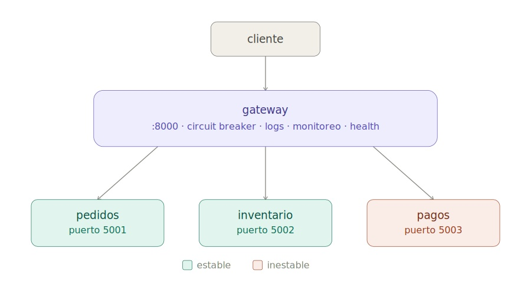
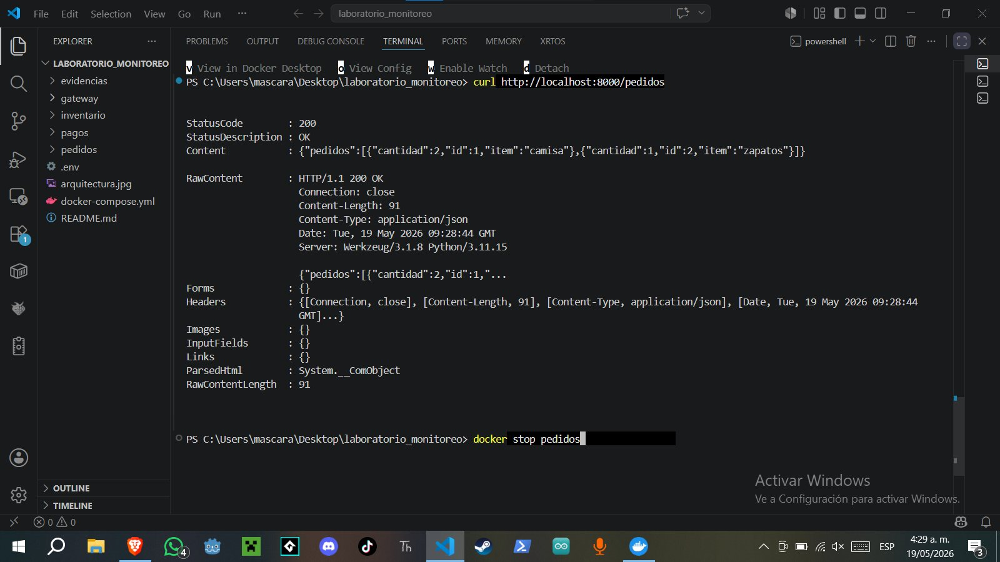
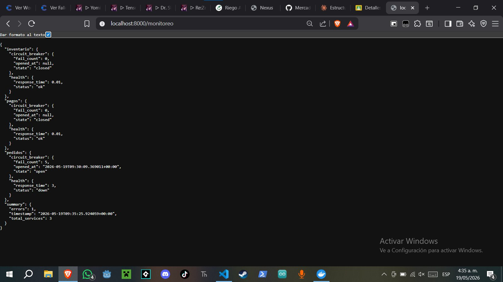
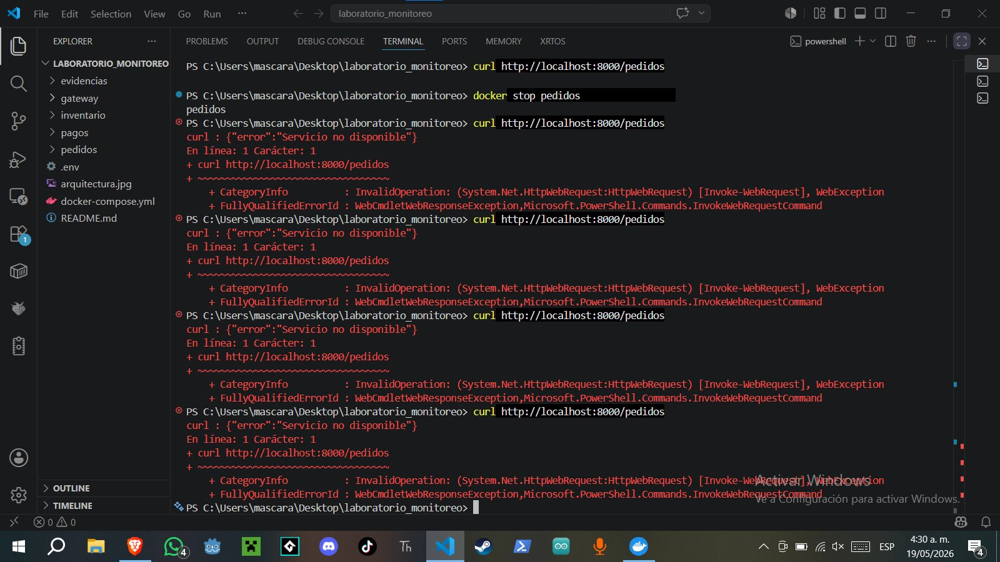
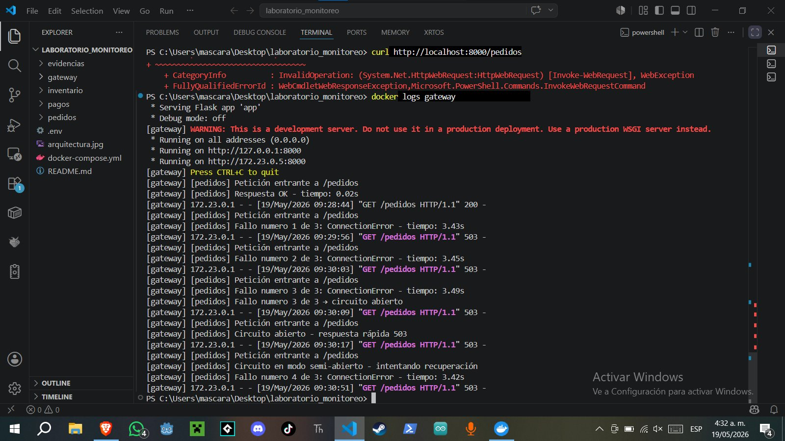

# Sistema de Pedidos Distribuido

Taller practico en parejas — Sistemas Distribuidos  
Escenario: sistema de pedidos con servicio de pagos inestable  
Stack: Python · Flask · Docker · Docker Compose

---

## Descripcion

Sistema distribuido compuesto por tres microservicios independientes (`pedidos`, `inventario`, `pagos`) y un `gateway` central que actua como punto de entrada unico. El servicio `pagos` simula fallos constantes. El objetivo es implementar monitoreo basico, health checks, metricas de disponibilidad y un circuit breaker que proteja al sistema de llamadas innecesarias.

---

## Arquitectura



| Servicio   | Puerto | Estado        |
|------------|--------|---------------|
| gateway    | 8000   | Punto central |
| pedidos    | 5001   | Estable       |
| inventario | 5002   | Estable       |
| pagos      | 5003   | Inestable     |

---

## Ejecucion

```powershell
docker compose up --build
```

El sistema carga variables desde `.env`:

```env
FAIL_MODE=always
FAIL_RATE=0.8
PEDIDOS_PORT=5001
INVENTARIO_PORT=5002
PAGOS_PORT=5003
GATEWAY_PORT=8000
```

---

## Endpoints disponibles

| Endpoint                                  | Metodo | Descripcion                               |
|-------------------------------------------|--------|-------------------------------------------|
| `http://localhost:8000/pedidos`           | GET    | Lista de pedidos activos                  |
| `http://localhost:8000/inventario`        | GET    | Estado del inventario                     |
| `http://localhost:8000/pagos`             | POST   | Procesar pago (falla constantemente)      |
| `http://localhost:8000/estado/pedidos`    | GET    | Health check de pedidos via gateway       |
| `http://localhost:8000/estado/inventario` | GET    | Health check de inventario via gateway    |
| `http://localhost:8000/estado/pagos`      | GET    | Health check de pagos via gateway         |
| `http://localhost:8000/monitoreo`         | GET    | Estado consolidado de todos los servicios |

---

## FASE 1 - Despliegue inicial

Desde la raiz del proyecto:

```powershell
docker compose up --build
```

```
[+] Building 4/4
 - pedidos     Built                          2.1s
 - inventario  Built                          2.0s
 - pagos       Built                          2.3s
 - gateway     Built                          2.4s
[+] Running 4/4
 - Container pedidos     Started              0.6s
 - Container inventario  Started              0.7s
 - Container pagos       Started              0.8s
 - Container gateway     Started              1.1s
gateway     |  * Running on all addresses (0.0.0.0)
gateway     |  * Running on http://127.0.0.1:8000
pedidos     |  * Running on http://0.0.0.0:5000
inventario  |  * Running on http://0.0.0.0:5000
pagos       |  * Running on http://0.0.0.0:5000
```

Verificar que los contenedores esten activos:

```powershell
docker ps
```

```
CONTAINER ID   IMAGE                             PORTS                    NAMES
a1b2c3d4e5f6   laboratorio_monitoreo-gateway     0.0.0.0:8000->8000/tcp   gateway
b2c3d4e5f6a1   laboratorio_monitoreo-pagos       0.0.0.0:5003->5000/tcp   pagos
c3d4e5f6a1b2   laboratorio_monitoreo-inventario  0.0.0.0:5002->5000/tcp   inventario
d4e5f6a1b2c3   laboratorio_monitoreo-pedidos     0.0.0.0:5001->5000/tcp   pedidos
```

---

## FASE 2 - Logs

El gateway registra cada peticion con su resultado, tiempo de respuesta y conteo de fallos usando el formato `[servicio] mensaje`.

Peticion exitosa a `/pedidos`:

```powershell
curl http://localhost:8000/pedidos
```

```
gateway  | [gateway] [pedidos] Peticion entrante a /pedidos
gateway  | [gateway] [pedidos] Respuesta OK - tiempo: 0.12s
```

```json
{
  "pedidos": [
    {"id": 1, "item": "camisa", "cantidad": 2},
    {"id": 2, "item": "zapatos", "cantidad": 1}
  ]
}
```

Peticion a `/pagos` con `FAIL_MODE=always` — primer fallo:

```powershell
curl -X POST http://localhost:8000/pagos
```

```
gateway  | [gateway] [pagos] Peticion entrante a /pagos
pagos    | [pagos] Peticion entrante a /pagos
pagos    | [pagos] Simulacion de fallo activo - retorno 503
gateway  | [gateway] [pagos] Error HTTP 503 - tiempo: 0.08s
gateway  | [gateway] [pagos] Fallo numero 1 de 3: ConnectionError - tiempo: 0.08s
```

Tercer fallo — circuito se abre:

```
gateway  | [gateway] [pagos] Peticion entrante a /pagos
gateway  | [gateway] [pagos] Fallo numero 3 de 3 -> circuito abierto
```

Llamada siguiente con circuito ya abierto — respuesta instantanea sin contactar el servicio:

```
gateway  | [gateway] [pagos] Peticion entrante a /pagos
gateway  | [gateway] [pagos] Circuito abierto - respuesta rapida 503
```

`pedidos` e `inventario` continuan respondiendo sin verse afectados:

```
gateway  | [gateway] [inventario] Peticion entrante a /inventario
gateway  | [gateway] [inventario] Respuesta OK - tiempo: 0.09s
```



---

## FASE 3 - Health Checks

Cada microservicio expone `/health`. El gateway expone `/estado/<servicio>` para consultarlos de forma centralizada.

Health check directo en cada servicio:

```powershell
curl http://localhost:5001/health
```
```json
{"status": "ok", "service": "pedidos"}
```

```powershell
curl http://localhost:5002/health
```
```json
{"status": "ok", "service": "inventario"}
```

```powershell
curl http://localhost:5003/health
```
```json
{"status": "ok", "service": "pagos"}
```

El endpoint `/health` de `pagos` responde `ok` porque esta separado del endpoint `/pagos` que falla.

Health checks a traves del gateway:

```powershell
curl http://localhost:8000/estado/pedidos
```
```json
{"status": "ok", "service": "pedidos"}
```

```powershell
curl http://localhost:8000/estado/inventario
```
```json
{"status": "ok", "service": "inventario"}
```

```powershell
curl http://localhost:8000/estado/pagos
```
```json
{"status": "ok", "service": "pagos"}
```

Simulacion con el contenedor de `pagos` detenido:

```powershell
docker stop pagos
curl http://localhost:8000/estado/pagos
```

```json
{"status": "down"}
```

HTTP 503 — log del gateway:

```
gateway  | [gateway] [pagos] Fallo numero 1 de 3: ConnectionError - tiempo: 3.00s
```

---

## FASE 4 - Monitoreo consolidado

El endpoint `/monitoreo` consulta el `/health` de todos los servicios, mide tiempos de respuesta y devuelve un reporte con el estado del circuit breaker.

Con todos los servicios activos:

```powershell
curl http://localhost:8000/monitoreo
```

```json
{
  "pedidos": {
    "health": {"status": "ok", "response_time": 0.11},
    "circuit_breaker": {"state": "closed", "fail_count": 0, "opened_at": null}
  },
  "inventario": {
    "health": {"status": "ok", "response_time": 0.09},
    "circuit_breaker": {"state": "closed", "fail_count": 0, "opened_at": null}
  },
  "pagos": {
    "health": {"status": "ok", "response_time": 0.07},
    "circuit_breaker": {"state": "open", "fail_count": 3, "opened_at": "2026-05-13T17:45:02.123456+00:00"}
  },
  "summary": {
    "total_services": 3,
    "errors": 0,
    "timestamp": "2026-05-13T17:45:02.456789+00:00"
  }
}
```

Log generado por el endpoint:

```
gateway  | [gateway] [monitoreo] Estado de servicios: {'pedidos': {'health': {'status': 'ok', 'response_time': 0.11}, ...}, 'summary': {'total_services': 3, 'errors': 0}}
```

Con `pagos` detenido:

```powershell
docker stop pagos
curl http://localhost:8000/monitoreo
```

```json
{
  "pedidos": {
    "health": {"status": "ok", "response_time": 0.13},
    "circuit_breaker": {"state": "closed", "fail_count": 0, "opened_at": null}
  },
  "inventario": {
    "health": {"status": "ok", "response_time": 0.10},
    "circuit_breaker": {"state": "closed", "fail_count": 0, "opened_at": null}
  },
  "pagos": {
    "health": {"status": "down", "response_time": 3.00},
    "circuit_breaker": {"state": "open", "fail_count": 3, "opened_at": "2026-05-13T17:45:02.123456+00:00"}
  },
  "summary": {
    "total_services": 3,
    "errors": 1,
    "timestamp": "2026-05-13T17:48:15.789012+00:00"
  }
}
```

```
gateway  | [gateway] [monitoreo] Estado de servicios: {..., 'pagos': {'health': {'status': 'down', 'response_time': 3.0}, 'circuit_breaker': {'state': 'open', 'fail_count': 3}}, 'summary': {'total_services': 3, 'errors': 1}}
```



---

## FASE 5 - Metricas y Circuit Breaker

Ciclo completo del circuit breaker — tres llamadas consecutivas a `/pagos`:

```
gateway  | [gateway] [pagos] Peticion entrante a /pagos
gateway  | [gateway] [pagos] Fallo numero 1 de 3: ConnectionError - tiempo: 0.08s
gateway  | [gateway] [pagos] Peticion entrante a /pagos
gateway  | [gateway] [pagos] Fallo numero 2 de 3: ConnectionError - tiempo: 0.07s
gateway  | [gateway] [pagos] Peticion entrante a /pagos
gateway  | [gateway] [pagos] Fallo numero 3 de 3 -> circuito abierto
```

Circuito abierto — respuesta instantanea sin llamar al servicio:

```
gateway  | [gateway] [pagos] Peticion entrante a /pagos
gateway  | [gateway] [pagos] Circuito abierto - respuesta rapida 503
```

```json
{"error": "Servicio no disponible"}
```

Tras 10 segundos — modo semi-abierto:

```
gateway  | [gateway] [pagos] Circuito en modo semi-abierto - intentando recuperacion
```

Recuperacion exitosa cambiando `FAIL_MODE=none` en `.env` y reconstruyendo:

```
gateway  | [gateway] [pagos] Respuesta OK - tiempo: 0.06s
gateway  | [gateway] [pagos] Recuperacion OK -> circuito cerrado
```

Logs completos del gateway al final de la prueba:

```powershell
docker logs gateway
```

```
[gateway] [pedidos] Peticion entrante a /pedidos
[gateway] [pedidos] Respuesta OK - tiempo: 0.12s
[gateway] [inventario] Peticion entrante a /inventario
[gateway] [inventario] Respuesta OK - tiempo: 0.09s
[gateway] [pagos] Peticion entrante a /pagos
[gateway] [pagos] Fallo numero 1 de 3: ConnectionError - tiempo: 0.08s
[gateway] [pagos] Peticion entrante a /pagos
[gateway] [pagos] Fallo numero 2 de 3: ConnectionError - tiempo: 0.07s
[gateway] [pagos] Peticion entrante a /pagos
[gateway] [pagos] Fallo numero 3 de 3 -> circuito abierto
[gateway] [pagos] Peticion entrante a /pagos
[gateway] [pagos] Circuito abierto - respuesta rapida 503
[gateway] [pagos] Circuito en modo semi-abierto - intentando recuperacion
[gateway] [pagos] Recuperacion OK -> circuito cerrado
[gateway] [monitoreo] Estado de servicios: {'pedidos': {'health': {'status': 'ok', 'response_time': 0.11}, ...}}
```

Resumen de metricas:





| Metrica                                      | Valor observado |
|----------------------------------------------|-----------------|
| Tiempo de respuesta pedidos                  | 0.10 - 0.13 s   |
| Tiempo de respuesta inventario               | 0.09 - 0.12 s   |
| Tiempo de respuesta pagos (fallando)         | 3.00 s (timeout)|
| Tiempo de respuesta pagos (circuito abierto) | < 0.01 s        |
| Fallos para abrir el circuito                | 3               |
| Cooldown hasta modo semi-abierto             | 10 s            |
| Servicios afectados por caida de pagos       | 0               |

---

## Tabla de pruebas

| Prueba                            | Comando                                         | Resultado esperado             |
|-----------------------------------|-------------------------------------------------|--------------------------------|
| Levantar el sistema               | `docker compose up --build`                     | 4 contenedores activos         |
| Consultar pedidos                 | `curl http://localhost:8000/pedidos`            | JSON con lista de pedidos      |
| Consultar inventario              | `curl http://localhost:8000/inventario`         | JSON con stock de productos    |
| Llamar a pagos (3 veces)          | `curl -X POST http://localhost:8000/pagos` x3   | 503 + circuito abierto en log  |
| Llamar a pagos (circuito abierto) | `curl -X POST http://localhost:8000/pagos`      | 503 instantaneo                |
| Health check via gateway          | `curl http://localhost:8000/estado/pagos`       | `{"status": "ok"}`             |
| Apagar pagos y verificar health   | `docker stop pagos` + mismo curl                | `{"status": "down"}` + 503     |
| Monitoreo consolidado             | `curl http://localhost:8000/monitoreo`          | JSON con estado de 3 servicios |
| Ver logs                          | `docker logs gateway`                           | Registro completo de eventos   |

---

## Estructura del proyecto

```
laboratorio_monitoreo/
├── .env
├── docker-compose.yml
├── gateway/
│   ├── app.py
│   ├── Dockerfile
│   └── requirements.txt
├── pedidos/
│   ├── app.py
│   ├── Dockerfile
│   └── requirements.txt
├── inventario/
│   ├── app.py
│   ├── Dockerfile
│   └── requirements.txt
└── pagos/
    ├── app.py
    ├── Dockerfile
    └── requirements.txt
```

---

## Configuracion de modos de fallo

Editar `.env` para cambiar el comportamiento de `pagos`:

| FAIL_MODE  | Comportamiento                                      |
|------------|-----------------------------------------------------|
| `always`   | Siempre devuelve 503 (modo por defecto)             |
| `random`   | Falla segun la probabilidad definida en `FAIL_RATE` |
| Otro valor | Responde OK normalmente                             |

Despues de editar, reconstruir:

```powershell
docker compose up --build
```
