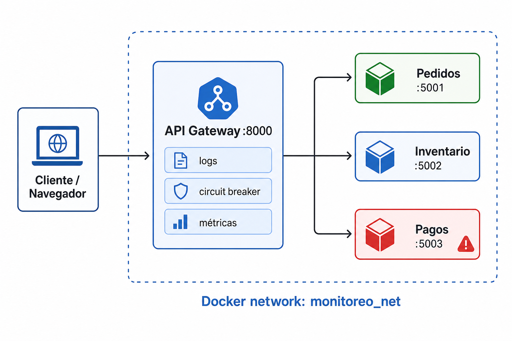
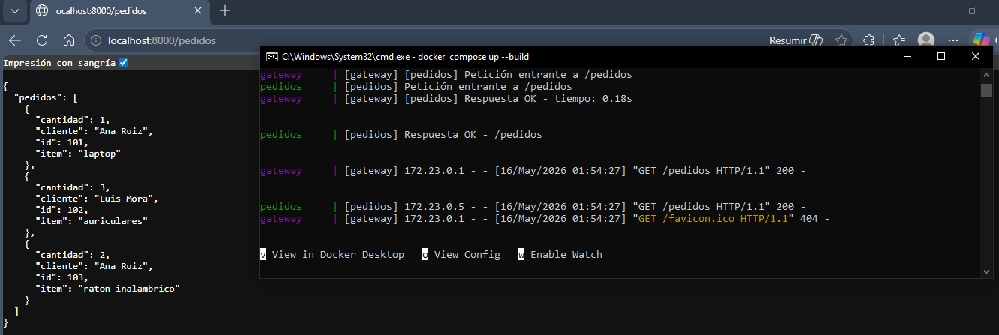
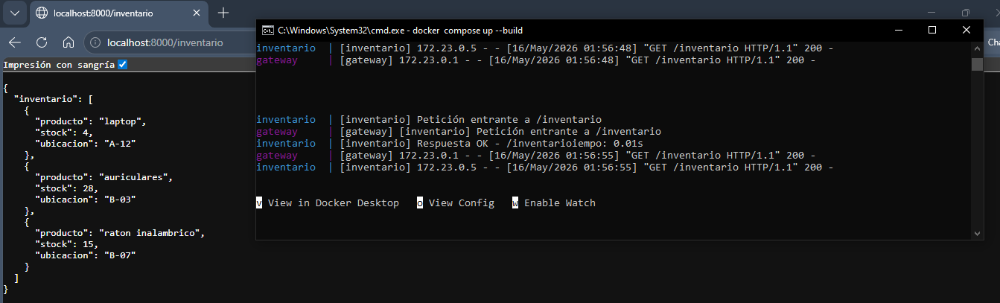
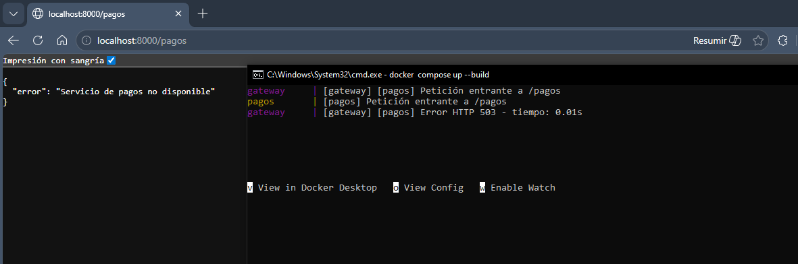
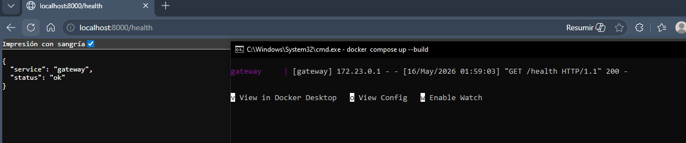
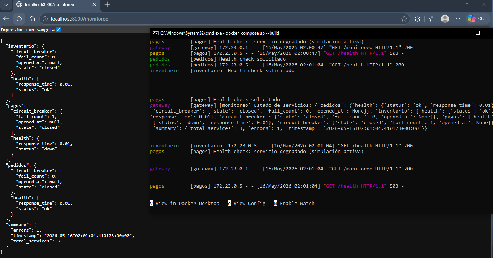
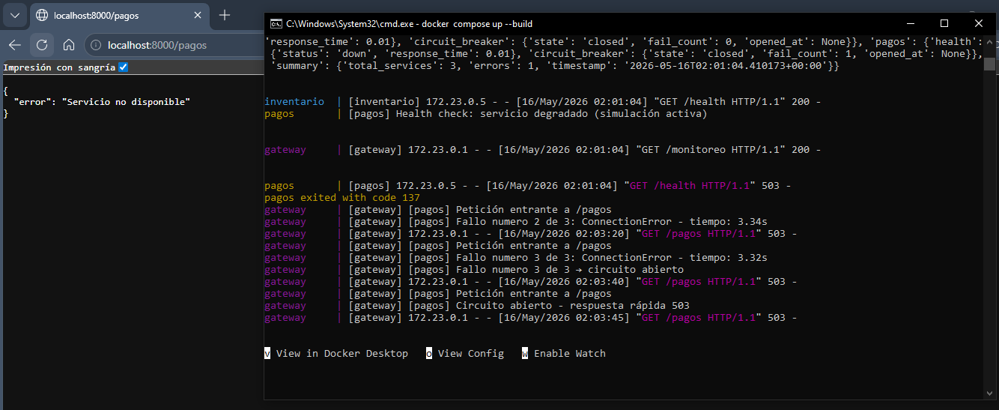
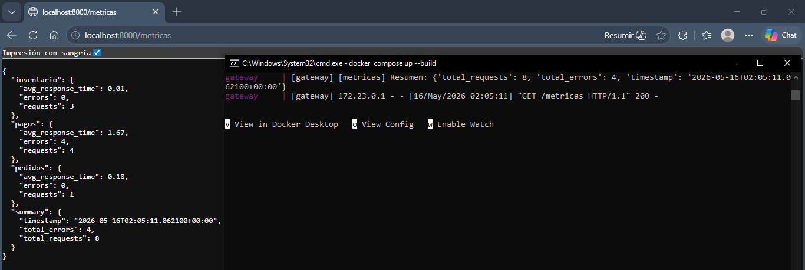
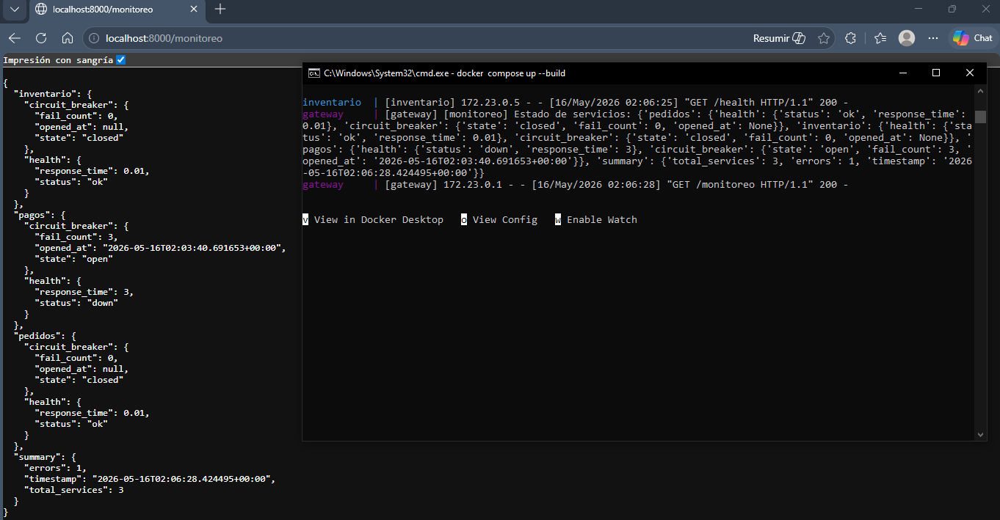
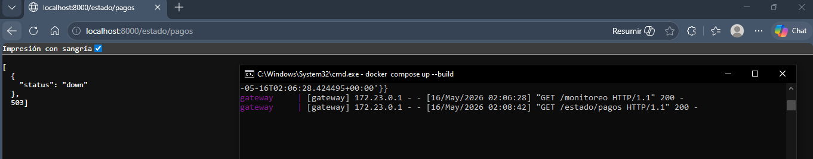

# Sistema de Pedidos Distribuido — Monitoreo básico

Taller práctico: sistema distribuido con servicios **pedidos**, **inventario** y **pagos** (inestable). El **gateway** centraliza el acceso, registra logs, expone health checks, monitoreo agregado, métricas y un **circuit breaker** para proteger al sistema cuando `pagos` falla.

---

## Arquitectura

El proyecto sigue un patrón de **microservicios** orquestados con **Docker Compose**. El cliente solo habla con el gateway; los microservicios se comunican en una red interna.

| Componente   | Puerto (host) | Rol |
|-------------|---------------|-----|
| **Gateway** | 8000          | API única, proxy, logs, monitoreo, circuit breaker |
| **Pedidos** | 5001          | Lista de pedidos de ejemplo |
| **Inventario** | 5002       | Stock de productos |
| **Pagos**   | 5003          | Procesamiento de pagos con simulación de fallos (~80 %) |

## Monitoreo implementado

El laboratorio se cubre en cinco fases, en este orden:

1. **Logs** — prefijos `[gateway]`, `[pedidos]`, `[inventario]`, `[pagos]` en consola Docker.
2. **Health checks** — `GET /health` por servicio en el gateway vía `/estado/*`.
3. **Monitoreo agregado** — `GET /monitoreo` (salud por servicio, circuit breaker, resumen).
4. **Simulación de fallos en pagos** — ~80 % de errores y/o `docker compose stop pagos`.
5. **Métricas** — `GET /metricas` (peticiones, errores, tiempo medio por servicio).

Los detalles de cada fase están en las subsecciones siguientes.

### Fase 1 — Logs

Cada servicio usa `logging` de Python con prefijo identificable (`[gateway]`, `[pedidos]`, `[inventario]`, `[pagos]`).

| Servicio    | Qué se registra |
|------------|-----------------|
| Gateway    | Peticiones proxy, tiempos de respuesta, errores HTTP, fallos de conexión, apertura/cierre de circuito, reportes de monitoreo |
| Pedidos / Inventario | Entrada a ruta, respuesta OK, health check |
| Pagos      | Peticiones, fallos simulados (número de petición), health degradado |

Ver logs en tiempo real:

**Evidencia (capturas de consola por servicio):**

### Fase 2 — Health checks

Cada microservicio expone `GET /health`. El gateway expone además:

| Endpoint | Descripción |
|----------|-------------|
| `GET /estado/pedidos` | Health de pedidos |
| `GET /estado/inventario` | Health de inventario |
| `GET /estado/pagos` | Health de pagos |
| `GET /health` | Health del propio gateway |

`pagos` devuelve **503** mientras la simulación de fallos esté activa, para reflejar disponibilidad real.

### Fase 3 — Monitoreo agregado

`GET /monitoreo` consulta el `/health` de los tres servicios y devuelve un reporte unificado con:

- Estado y tiempo de respuesta por servicio
- Estado del **circuit breaker** (`open` / `closed`, contador de fallos)
- Resumen: total de servicios con error y timestamp

### Fase 4 — Simulación de fallos

El servicio **pagos** falla de forma interna (**4 de cada 5** peticiones → ~80 % de error 503), sin variables de entorno.

| Acción | Comando / endpoint |
|--------|-------------------|
| Fallos automáticos | Por defecto al levantar el stack |
| Desactivar simulación | `POST http://localhost:5003/control/simulacion` |
| Apagar el servicio (Fase 4) | `docker compose stop pagos` |

Tras apagar `pagos`, el monitoreo marca el servicio como `down`, el gateway registra errores de conexión y el circuit breaker puede abrirse tras 3 fallos consecutivos.

### Fase 5 — Métricas

`GET /metricas` en el gateway acumula por servicio:

- Cantidad de **peticiones**
- Cantidad de **errores**
- **Tiempo medio de respuesta** (`avg_response_time`)

Los datos se actualizan con cada llamada proxy que pasa por el gateway.

---

## Resultados observados

**Logs observados:** en `pagos` aparecen mensajes `Simulación de fallo activa`; en `gateway`, `Error HTTP 503` y tras 3 fallos `circuito abierto`.

### Escenario B — Métricas tras tráfico de prueba

Tras varias llamadas a `/pedidos`, `/inventario` y `/pagos`, los contadores en `/metricas` coinciden con lo ilustrado en la captura de **Fase 5 — Métricas** (`Fase5_metricas.PNG`).

### Escenario C — Servicio pagos detenido (`docker compose stop pagos`)

| Indicador | Resultado |
|-----------|-----------|
| `GET /monitoreo` | `pagos.health.status` = `down`, `response_time` ≈ timeout (3 s) |
| `GET /pagos` vía gateway | 503 — conexión rechazada o circuito abierto |
| Logs gateway | `ConnectionError` / `Fallo numero X de 3` |
| Disponibilidad | Pedidos e inventario siguen operativos; solo pagos no disponible |

---

### Endpoints principales

| Método | URL | Descripción |
|--------|-----|-------------|
| GET | `http://localhost:8000/pedidos` | Proxy a pedidos |
| GET | `http://localhost:8000/inventario` | Proxy a inventario |
| POST/GET | `http://localhost:8000/pagos` | Proxy a pagos |
| GET | `http://localhost:8000/estado/pedidos` | Health pedidos |
| GET | `http://localhost:8000/estado/inventario` | Health inventario |
| GET | `http://localhost:8000/estado/pagos` | Health pagos |
| GET | `http://localhost:8000/monitoreo` | Monitoreo agregado |
| GET | `http://localhost:8000/metricas` | Métricas acumuladas |
| GET | `http://localhost:8000/health` | Health del gateway |
| POST | `http://localhost:5003/control/simulacion` | Activar/desactivar fallos en pagos |

